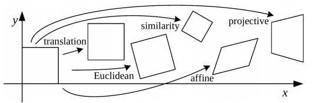
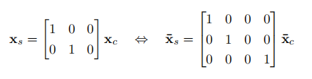
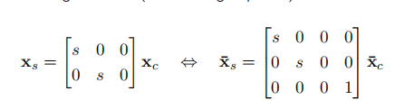
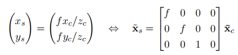
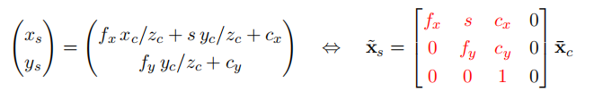
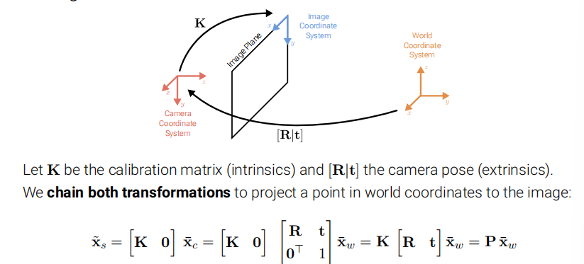
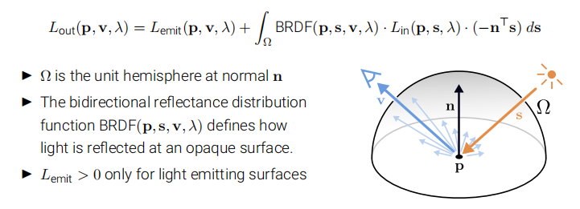
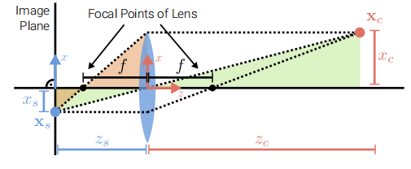

*key terms:how a 3D scene is projected onto a 2D image plane*

:smile:

# Primitives and Transformations

## 2D Points

- can be wirtten in **inhomogeneous coordinates**
- or in **homogeneous coordinates**
  - **projective space**

> Homogeneous vectors that differ only by **scale** are considered equivalent and define an equivalence class

- An inhomogeneous vector x could be converted to a homogeneous vector ->**augmented vector**
- Homogeneous points whose last element is $0$ are called **ideal points** or **points at infinity**

## 2D Lines

- using homogeneous coordinates $\widetilde{l}=(a,b,c)^{T}$
- normalize $\tilde{l}$  
- line at infinity $\tilde{l}_{\infty} = (0,0,1)^{T}$,which passes through all ideal points

## Cross Product

## 2D Line Arithmetic

- intersection of tow lines:$\tilde{x} = \tilde{l}_1 \times \tilde{l}_2$
- line joining two points:$\tilde{l}=\tilde{x}_1 \times \tilde{x}_2$

## 3D Points and Planes

- the same as case in 2D

## 3D Lines

- less elegent
- linear combination of two points

##  2D Transformations

- the action of a projective transformation on a co-vector can be represented by the transposed inverse of the matrix

## Direct Linear Transformation

> We want a homography estimation using a set of 2D correspondences

- Homography estimation:**find the relationship between two images of the same scene, but captured from different viewpoints**
- 

Stacking all equations into a $2N \times 9$ dimensional matrix $A$ leads to the **constrained least squares problem**,whose solution is the singular vector corresponding to the smallest singulat value of $A$(i.e.,the last column of $V$ when decomposing $A=UDV^T$)
[derivation](https://medium.com/@insight-in-plain-sight/estimating-the-homography-matrix-with-the-direct-linear-transform-dlt-ec6bbb82ee2b)

# Geometric Image Formation
## Orthographic Projection
- The x and y axes of the camera and image coordinate systems are shared
- Light rats are parallel to the z-coordinate of the camera coordinate system
- During projection, the z-coordinate is dropped,x and y remain the same

**scaled orthorgraphy**

## Perspective Projection

- The light ray passes through the camera center,the pixel $x_s$ and the point $x_c$
- Convention:the principal axis aligns with the z-axis
- 3D points in camera coordinates are mapped to the image plane by **dividing** them by their z component and multiplying with thr focal length.
- 
> *this projection is linear when using homogeneous coordinates*

- To ensure positive pixel coordinates,a **principal point offset** is usually added,which moves the image coordinate system to the corner of the image plane.
Now we can give the complete perspective projection model as follows:

- The left $3 \times 3$ submatrix is called **calibration matrix** $K$
- The parameters of $K$ are called camera intrinsics
- The skew $s$ arises due to the sensor not mouted perpendicular to the optical axis
- In practice,we often set $f_x =f_y$ and $s=0$
### Chaining Transformations

*Full Rank Representation*

The homogeneous vector $\tilde{x}_s$ is a 4D vector and must be normalized wrt. its 3rd entry to obtain inhomogeneous image pixels:
$\overline{x}_s = \tilde{x}_s / z_s = (x_s/z_s,y_s/z_s,1,1/z_s)^{T}$

# Photometric Image Formation
*Discuss how an image is formed in terms of pixel intensities and colors*
- Light is emitted by one or more light sources and reflected of refracted at surfaces of objects in the scene
**Rendering Equation**

> $n^Ts$  represents the inner product factor

- Typical BRDFs have a **diffuse** and a **specular** component
	- diffuse component scatters light uniformly in all directions
	- specular component depends strongly on the outgoing light direction
	
	
## Why camera lenses?
- Large and very small pinholes result in image blur
- small pinholes require long shutter times,which leads to motion blur
### Thin Lens Model

$\frac{1}{z_s}+\frac{1}{z_c}=\frac{1}{f}$

### Depth of Field
- For $z_c \rightarrow \infty$ ,we obtain $z_s=f$
- If the image plane is out of foucs,a 3D point projects to the **circle of confusion c**
- To control the size of $c$,we change the lens aperture
- The allowable depth variation that limits the circle of confusion is called *DOF* and is a function of both the focus distance and the lens aperture
> distance between the nearest and farthest objects that are acceptably sharp
- *f-number* is defined as $N = \frac{f}{d}$($d$: the aperture diameter)

# Questions(Not Found in Searching Engine)

1.normalize $\tilde{l} = (n_x,n_y,-d)^{T}$ why **minus** $d$?

2.DLT？
3.Under orthography,structure and motion can be estimated simultaneously using factorization methods(e.g.,via svm)
4.The skew $s$ arises due to the sensor not mouted perpendicular to the optical axis,only affects x axis?
