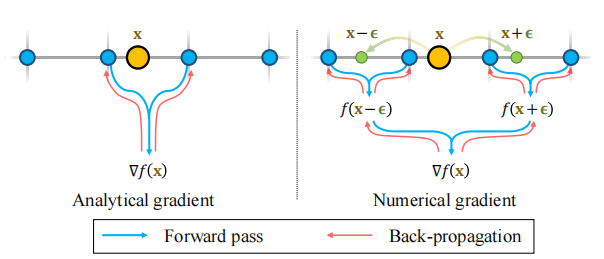

# Neuralangelo: High-Fidelity Neural Surface Reconstruction

## Abstract

从NeRF开始，基于神经表示的稠密三维重建掀起一股热潮，但是现有的方法在恢复真实世界场景的细节上表现不好。Neualangelo是一种新的3D表面重建方法，无需依赖深度信息，仅通过RGB图像即可实现高保真的3D场景重建。它将**多分辨率3D哈希网格**的表示能力和神经表面渲染SDF相结合。论文中使得这种方法得以实施的两个关键因素：

-  numerical gradients for computing higher-order derivatives as a smoothing operation.
-  coarse-to-fine optimization on the hash grids controlling different levels of details.

## Method

### 多分辨率哈希编码(Multi-resolution hash encoding)

一种高效的空间表示方法，使用不同分辨率的网格来编码三维点的空间信息。

#### Pipeline

- 在三维空间中设置多个分辨率的网格系统(即多分辨率图像，可以理解为我们划分的小立方体块的数量)。最粗糙的网格提供了最大的空间概览，最详细的网格有助于捕捉物体表面的细节。
- 哈希映射：对于每个输入位置，我们找到其在每个网格分辨率对应的位置，每个网格单元的角点都被映射到一个哈希条目中，这其中存储着编码的特征向量。我们使用三线性插值得到该输入点在特定分辨率下的特征向量。
- 我们将所有分辨率下的特征向量通过加权得到整合形成的特征向量，作为MLP的输入，这些权重由网络学习得到。

### Numerical Gradient Computation

在NeuS的文章里我们知道，SDF梯度场的范数为1，我们也利用这一性质进行优化：
$$
L_{eik}=\frac{1}{N}\sum_{i=1}^{N}(\Vert\nabla f(x_i)\Vert_2-1)^2
$$
但是对于哈希网格来说，由于$x_i$跨越网格单元边界时，哈希条目发生变化，因此哈希编码的导数并不是全局连续的，仅在局部的voxel里连续。

因此在文章中将分析梯度改为数值梯度，如果数值梯度的步长$\epsilon$小于哈希编码的网格大小，则数值梯度等于分析梯度；否则，我们采用多个网格单元的哈希条目参与SDF梯度的计算。因此，通过表面法线反向传播允许多个网格的哈希条目同时接收优化更新。

### Progressive Levels of Details

- 步长

在数值梯度中较大的步长可以确保SDF法线在更大范围内保持一致，对应的是整体的轮廓；较小的步长避免平滑细节，有助于高保真表面的生成。在训练的过程中，将步长初始化为最粗的哈希网格大小，在优化的过程中不断减小。

- 哈希网格分辨率

在优化开始时，算法并不一开始就激活所有的哈希网格。相反，它只启用一套初始的粗糙哈希网格。这样做主要是因为如果一开始就激活了所有的网格，那么在要捕获几何细节时，细哈希网格首先必须要从使用大步长ϵ的粗略优化中“遗忘”，然后用更小的ϵ重新学习。在整个优化过程中当步长ϵ减小到哈希网格的空间大小时，逐步激活更细的哈希网格。

