# Combinational Logic Circuits

## Gate Circuits and Boolean Equations

### Binary Logic and Gates

- Binary variables take on one of two values
- Logical operators operate on binary values and binary variables
- Basic logical operators are the logic functions AND($\cdot$), OR(+) and NOT($\overline{}$).
- **Logic gates** implement logic functions

**Truth Tables**: a tabular listing of the values of a function for all possible combinations of values on its arguments

**Logic Function Implementation**: 

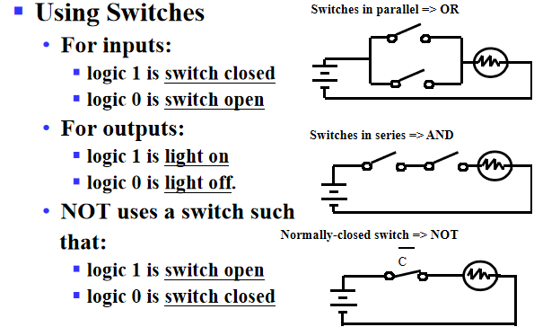

**Logic Gates**

**NAND和NOR是最基本的门，它们可以实现其他所有的门电路**

**Logical Gate Symbols and Behavior**

**Gate Delay**

- In actual physical gates, if one or more input changes causes the output to change, the output change does not occur instantaneously.
- The delay between an input change(s) and the resulting output change is the gate delay 

### Boolean Algebra

Basic identities:

!!! note

    1.左右公式是对偶的(The dual of an algebraic expression is obtained by interchanging + and · and interchanging 0’s and 1’s. )
    
    2.公式15的特殊性

**Boolean Operator Precedence**: Parenthese>NOT>AND>OR

Example: Proof$\overline{(X+Y)}Z+X\overline{Y}=\overline{Y}(X+Z)$
$$
\overline{(X+Y)}Z+X\overline{Y}=\overline{Y}(X+\overline{X}Z)=\overline{Y}(X+\overline{X})(X+Z)
$$

**Complementing Functions**: 

Use DeMorgan's Theorem to complement a function:

- Interchange AND and OR operators
- Complement each constant value and literal

!!! note

     注意保持运算顺序不变（by adding parenthese)

### Canonical Forms

任何逻辑函数可以写成SOM或POM的形式(Sum of Minterms or Product of Maxterms)

#### Minterms and Maxterms

- Minterms are AND terms with every variable present in either true or complemented form. 
- Maxterms are OR terms with every variable in true or complemented form.
- There are $2^n$ minterms or maxterms for $n$ variables.

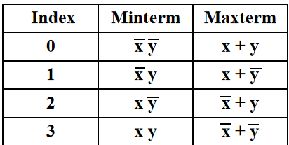

!!! note

     The index above(convert to binary form,with 1 corresponding to true) is important for describing which variables in the terms are true and which are complemented.
     即index是使得minterm=1(maxterm=0)的唯一取值。

**Standard Order**: All variables will be present in a minterm or maxterm and will be listed in the same order (usually alphabetically) 

#### Canonical Sum of Minterms

- Any boolean function can be expressed as a sum of minterms.
- Expand all terms first to explicitly list all minterms("ANDing" any term missing a varaible $v$ with a term $(v+\overline{v})$)

#### Canonical Product of Maxterms

- Any Boolean Function can be expressed as a product of maxterms
- expand all terms first to explicitly list all maxterms.  Do this by first applying the second distributive law , “ORing” terms missing variable $v$ with a term equal to $v\cdot \overline{v}$ and then applying the distributive law again

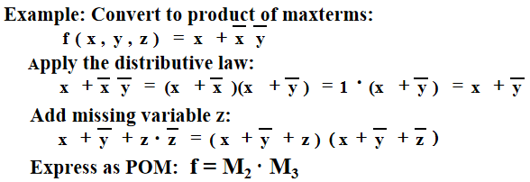

#### Standard Forms

- Standard Sum-of-Products(SOP) form: equations are written as an OR of AND terms 
- Standard Product-of-Sums(POS) form: equations are written as an AND of OR terms

SOP and POS are **two-level** network of gates.

#### Observations

- Canonical Forms (Sum-of-minterms, Product-of-Maxterms), or other standard forms (SOP, POS) differ in complexity
- Boolean algebra can be used to manipulate equations into simpler forms
- Simpler equations lead to simpler two-level implementations

即我们引入Canonical Forms是为了方便使用minterm或maxterm表达所有逻辑函数（使用index的方式使表达式看起来更简洁），但我们仍然需要布尔代数的内容对canonical forms 或standord forms 进行化简，使得逻辑函数更为简洁，减少门电路的级数。这就是我们接下来引入门电路优化的原因。

## Circuit Optimization

*Goal*: obtain the simplest implementation for a given function

Optimization requires a cost criterion to measure the simplicity of a circuit:

- Literal cost
- Gate input cost
- Gate input cost with NOTs

### Two-Level Optimization

#### Literal Cost

- Literal : a variable or its complement
- Literal cost : the number of literal appearances in a Boolean expression          corresponding to the logic circuit diagram.

#### Gate Input Cost

- the number of inputs to the gates in the implementation corresponding exactly to the given equation or equations.
- For SOP and POS equations, it can be found from the equation(s) by finding the sum of:
     - all literal appearances
     - the number of terms excluding single literal terms(G), and optionally, the number of distinct complemented single literals(GN)

Example: $F=BD+A\overline{B}C+A\overline{B}\overline{D}+AB\overline{C} \,,L=11,G=L+4=15,GN=G+3=18(only\,BCD)$

知道了如何通过cost 判断门电路的简洁程度之后，我们要做的就是优化电路（即化简表达式），那么我们该如何知道什么时候停止化简，什么时候化简的结果是最优的？这就需要引入卡诺图。

### Karnaugh Maps(K-map)

A K-map is a collection of squares:

- Each square represents a minterm
- The collection of squares is a graphical  representation of a Boolean function
- **Adjacent squares differ in the value of *one* variable**
- Alternative algebraic expressions for the same function are derived by recognizing patterns of squares

The K-map can be viewed as:

- A reorganized version of the truth table
- A topologically-warped Venn diagram as used to visualize sets in algebra of sets.

#### Two Variable Maps

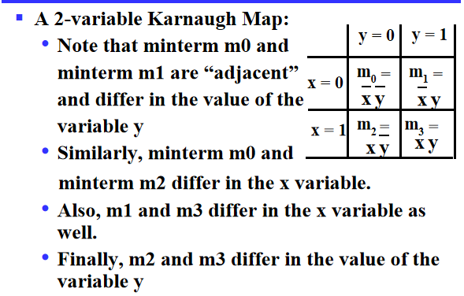

#### Three Variable Maps

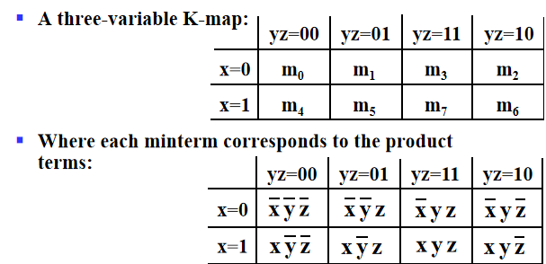

!!! note

     注意由于K-Map的要求，相邻的格子只能差一位，所以注意Minterm的顺序0,1,3,2，4,5,7,6

**Alternative Map Labeling**:

我们经常使用左图的标识方法

Example: 

**Combining Squares**

By combining squares, we reduce number of literals in a product term, reducing the literal cost, thereby reducing the other two cost criteria.

注意只能画$2^n$大小的squares

On a 3-variable K-Map:

- One square represents a minterm with three variables
- Two adjacent squares represent a product term with two variables
- Four “adjacent” terms represent a product term with one variable
- Eight “adjacent” terms is the function of all ones (no variables) = 1.

Example:

- Reduced literal product terms for SOP standard forms correspond to rectangles on K-maps containing cell counts that are powers of 2. 
- Topological warps of 3-variable K-maps that show all adjacencies:(即可以把图卷起来，两个边边如果都是1也可圈圈)

**化简思路：用最大的最少的圈把所有的 1 圈完.(圈与圈之间可以有交叉)**

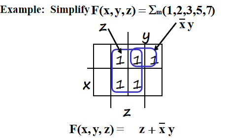

#### Four Variable Maps

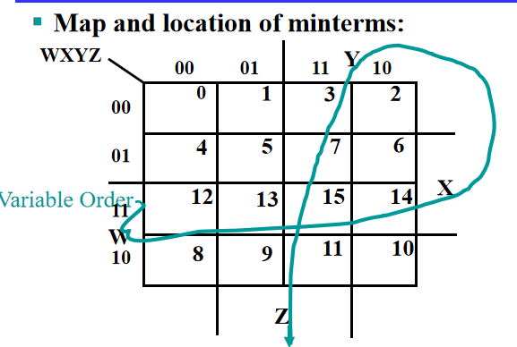

!!! note

     注意顺序和位置！
     
     and 四个角也可以圈（0，2，8，10）

#### Don't Cares in K-Maps

Sometimes  a function table or map contains entries for which it is known:

- the input values for the minterm will never occur
- the output value for the minterm is not used

In these cases the output value is defined as a “don't care”, **By placing “don't cares” ( an “x” entry) in the function table or map, the cost of the logic circuit may be lowered.**

Example :  A logic function having the binary codes for the BCD digits as its inputs. Only the codes for 0 through 9 are used.  The six codes, 1010 through 1111 never occur, so the output values for these codes are “x” to represent “don’t cares.”

对于无关项，圈与不圈取决于怎样才能把卡诺图化为最简。

首先我们更熟悉minterm, 所以考虑先得到SOP后取反，这里要注意此时圈得是空格而非1！

#### Systematic Simplification

- A **Prime Implicant** is a product term obtained by combining the maximum possible number of adjacent squares in the map into a rectangle with the number of squares a power of 2.
- A prime implicant is called an **Essential Prime Implicant** if it is the **only** prime implicant that covers (includes) one or more minterms.

即如果某个 "1" 的质蕴涵项只有一个，那么它是必要的（这个圈圈一定有）

Example:

Prime Implicants are AB, B C' D', A' C' D', A' B' D', A' B' C, A' C D, B C D. only AB is essential.

#### Optimization Algorithm(Summary)

- Find all prime implicants.
- Include all essential prime implicants in the solution
- Select a minimum cost set of non-essential prime implicants to cover all minterms not yet covered
- Selection Rule: Minimize the overlap among prime implicants as much as possible. In particular, in the final solution, make sure that each prime implicant selected includes **at least one minterm not included in any other** prime implicant selected.

### Multi-Level Circuit Optimization

两级门的延迟低，但成本高，有时候我们不要求非常低的延迟，就考虑使用逻辑函数将表达式化简，将两级门转变为多级电路。

## Additional Gates and Circuits

### Integrated Circuits

Integrated circuit (informally, a “**chip**”) is a semiconductor crystal (most often silicon) containing the electronic components for the digital gates and storage elements which are interconnected on the chip.

**Terminology-Levels of chip integration（用门个数衡量规模）**

- SSI(small-scale integrated)-fewer than 10 gates
- MSI(medium-scale integrated)-10 to 100 gates
- LSI (large-scale integrated) - 100 to thousands of gates
- VLSI(very-large-scale-integrated)-thousands to 100s of millions of gates

**Technology Parameters**

#### Fan-in(扇入系数)
the number of inputs available on a gate,即一个门输入端的上限

#### Fan-out(扇出系数)
the number of standard loads driven by a gate output

#### Cost
The cost of a gate is proportional to the chip area occupied by the gate, the gate area is roughly proportional to the number and size of transistors and the amount of wiring connecting them, ignoring the wiring area, the gate area is roughly proportional to the gate input count, so gate input count can be a rough measure of gate cost.

#### Propagation Delay
the time for a change on an input of a gate to propagate to the output.
- Delay is usually measured at the 50% point with respect to the H and L output voltage levels.（输入电压改变的中点到输出电压改变的中点）
- High-to-low($t_{PHL}$) and low-to-high($t_{PLH}$) output signal changes may have different propagation delays.(注意是输出端！！)
- 定义传输延迟$t_{pd}=\frac{t_{PHL}+t_{PLH}}{2}$

**Delay Mode**
- Transport delay: a change in the output in response to a change on the inputs occurs after a fixed specified delay
- Inertial delay - similar to transport delay, except that if the input changes such that the output is to change twice in a time interval less than the rejection time, the output changes do not occur.(在惯性延迟下，很窄的脉冲会被消除掉)

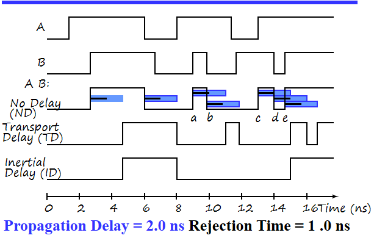

在inertial delay中，ab,de脉冲变化时间小于rejection time，因此不会发生

**Circuit Delay**
在门上标数字表示该门的传输延迟时间

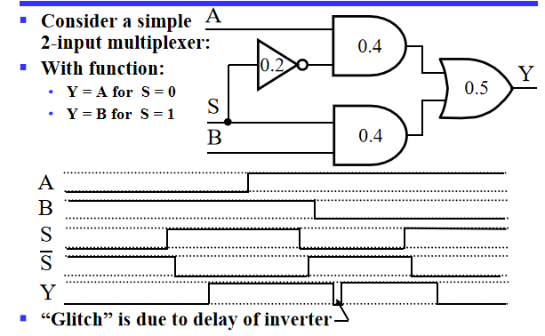

- 最开始S从0变为1，0.9s后Y从0变为1
- 当S从1变为0，上面的门0.6s后变为1，下面的门0.4s后变为0，故0.9s后Y先变为0，再过0.2s变为1(由于两条传输路径导致在波形图中出现尖峰，称之为电路的竞争与冒险)

**Fan-out and Delay**
The fan-out loading a gate’s output affects the gate’s propagation delay
SL(Standard Load): 以非门为标准。即带动一个非门需要多少的负载

#### Cost/Performance Tradeoffs

### Other Gate Types

**Gate classifications**

- Primitive gate: a gate that can be described using a single primitive operation type (AND or OR) plus an optional inversion(s).
- Complex gate - a gate that requires more than one primitive operation type for its description

#### Buffer

- A buffer is a gate with the function $F=X$
- In terms of Boolean function, a buffer is the same as a connection!
- The reason we use it: A buffer is **an electronic amplifier** used to improve circuit voltage levels and increase the speed of circuit operation(降低传输延迟).

#### NAND Gate

Applying DeMorgan's Law gives Invert-OR(NAND)

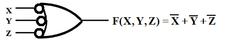

- AND-Invert and Invert-OR both represent the NAND gate. Having both makes visualization of circuit function easier.
- A NAND gate with one input degenerates to an inverter.

#### NOR Gate

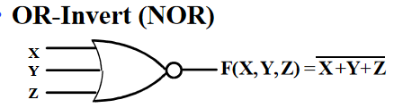

Applying DeMorgan's Law gives Invert-AND(NOR)

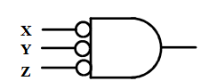

- OR-Invert and Invert-AND both represent the NOR gate. Having both makes visualization of circuit function easier.
- A NOR gate with one input degenerates to an inverter.

  

- The NOR gate and the NAND gate is a natural implementation for some technologies other than CMOS in terms of *chip area and speed*.

- They are universal gate-a gate type that can implement any Boolean function.
- They usually doesn't have a operation symbol defined(不满足交换律，不方便进行逻辑运算，我们一般使用与或非进行逻辑运算，最后电路实现时转化为与非和或非门)

#### Exclusive OR/Exclusive NOR

Uses for the XOR and XNORs gate include:

- Adders/subtractors/multipliers
- Counters/incrementers/decrementers
- Parity generators/checkers

**Definitions**

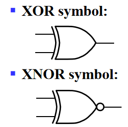

- XOR function: $X\oplus Y=X\overline{Y}+\overline{X}Y$ (X or Y, but not both)
- XNOR function(known as equivalence): $\overline{X\oplus Y}=XY+\overline{X}\overline{Y}$
- XOR and XNOR gates do no exist for more than two inputs. Instead, they are replaced by **odd and even functions**. 

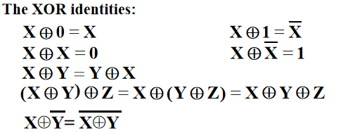

**Implementations**

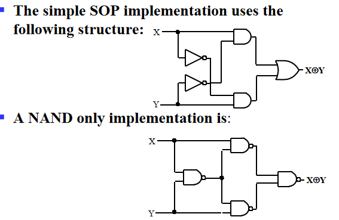

#### Odd and Even Functions

The XOR function can be extended to 3 or more variables. For more than 2 variables, it is called an odd function or modulo 2 sum (Mod 2 sum), not an XOR，the complement of the odd function is the even function.

- The odd and even functions on a K-map form “checkerboard” patterns.（黑白棋盘的样子）
- The 1s of an odd function correspond to minterms having an index with an odd number of 1s.
- The 1s of an even function correspond to minterms having an index with an even number of 1s

**Implementation**

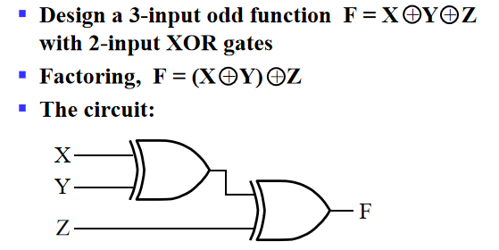

**Recall: Parity Generators and Checkers**

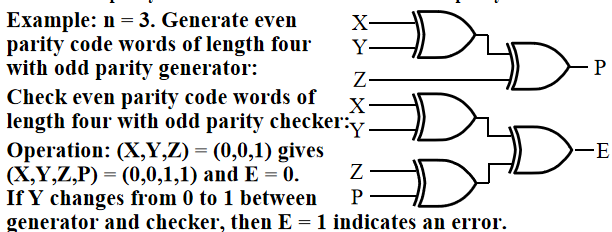

对第一章介绍的奇偶校验码的机理有了很好的解释： 假设X,Y,Z分别为0,0,1. 因此我们通过$P=X\oplus Y\oplus Z$构造出偶校验码(X,Y,Z,P中有1的个数为偶数)，因此$E=X\oplus Y\oplus Z\oplus P$应该为$0$, 若E输出为1，那么我们就可以知道传输中某一位出现了错误。

  

#### Hi -Impedance Outputs

Logic gates introduced thus far：

- have 1 and 0 output values
- **cannot have their outputs connected together**
- transmit signals on connections in only one direction

**Three-state logic adds a third logic value, Hi-Impedance (Hi-Z), giving three states: 0, 1, and Hi-Z on the outputs.**

**Hi-Z**:

- The Hi-Z value behaves as an open circuit, which means the output appeas to be disconnected
- It is as if a switch between the internal circuitry and the output has been opened.

***3-state buffer***

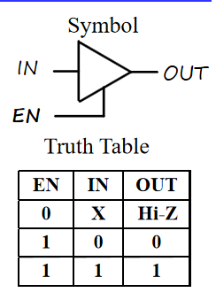

`IN`: the data input, `EN`: the control input

- For `EN = 0`, regardless of the value on `IN` (denoted by X), the output value is Hi-Z.
- For `EN = 1`, the output value follows the input value.

当我们想把多个门输出接在一起时，应该保证最多只有一个门具有有效输出（不然会烧坏电路）

***3-State Logic Circuit***

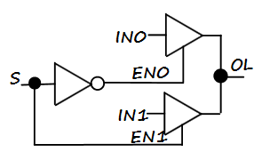

该三态逻辑门的`EN0`和`EN1`就不会同时使能

