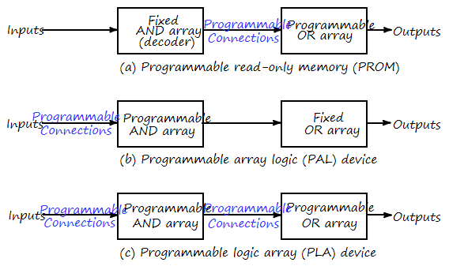
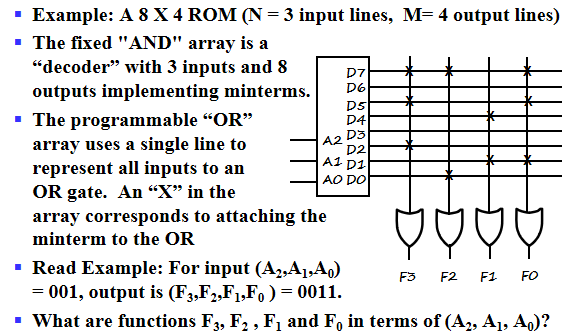
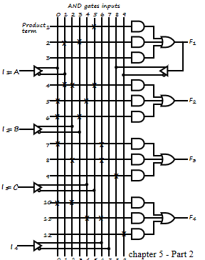
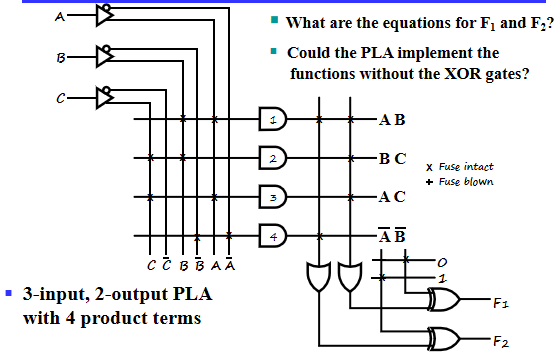

# Digital Hardware Implementation

## Programmable Implementation Technologies

### Programmable Configurations

- 只读存储器(Read Only Memory ROM): 由一个固定的与阵列和一个可编程的或阵列构成。
- Programmable Array Logic(PAL): 可编程与阵列和固定的或阵列。
- Programmable Logic Array(PLA): 与阵列和或阵列都可以编程。

### Read Only Memory

ROM包含$n$位数据输入，$m$位数据输出。我们将$n$位数据输入到译码器上，得到$2^n$个最小项。通过$m$个或门的编程选择其与最小项的连接关系。

要注意或门的画法，每个或门只有一根线，但是这根线与译码器输出的最小项都可以进行连接，与谁连接通过编程实现，在图上，选择连接的用叉表示。

由第三章的知识可知，ROM可以实现任何一个逻辑函数。

### PAL

**缺点**： 由于或门有限，不能保证像ROM一样实现任何一个逻辑函数。

**优点**：

-  在相同的芯片面积下，PAL可以拥有更多的输入输出引脚数量，即提高芯片利用率。
- 可以实现多级电路优化。

在PAL中，每个或门的输入引脚是固定的，每个引脚连接一个多输入的与门(可编程)。

可以注意到上图的电路中，我们把$F_1$输出的原变量和反变量又送回到与阵列中，通过$F_2,F_3,F_4$输出，从而实现了多级优化。

### PLA

**优点**：实现成本更低。

**缺点**：不能实现任何一个逻辑函数。无法实现多级优化。

观察上述电路，与阵列和或阵列的实现方式与ROM,PAL中相同。

值得注意的是，在输出端有两个异或门，每个门的引脚之一与一个0-1矩阵相连。该异或门实现了**可控求反**的功能。

PLA中最稀缺的是与门的个数，所以我们在设计的时候要考虑与门的重用，可以在卡诺图化简的时候考虑逻辑函数与逻辑函数的反函数。