# Registers and Register Transfers

## Registers, Microoperations and Implementations

### Registers and load enable

寄存器是一系列二进制存储单元的集合。我们可以把时序电路中的存储元件抽象成寄存器。

但是在计算机设计中，由于位数很多，因此我们使用之前时序电路的思想，画状态表状态图，是不现实的。因此有以下两种设计思路：

- 将整个计算机电路分成两个部分，一个是存储元件，一个是组合电路部分。组合电路去完成存储元件输出与次态和当前输入的关系。
- 设计出单位电路，组合成多位电路。

寄存器最基本的功能就是保存计算结果。因此寄存器起码需要有两种状态：**存储，使能加载新数据**。

对于存储，寄存器需要做到保存多个时钟周期的数据。

由于我们时序电路中最常用的是D触发器，因此我们考虑一下能否用D触发器来实现寄存器的功能？

D触发器在每个时钟周期都会根据输入更新数据，因此不符合存储多个时钟周期数据的需求。因此我们需要修改D触发器的电路。

有几种思路：

- 把时钟block掉。
- 使用SR或者JK触发器这些具有保持功能的触发器。(本质上是将触发器的输出返回到输入上)

**Load**信号：当Load为1时代表寄存器需要接收新数据，为0代表保存。有时候会用$\overline{Load}$表示。

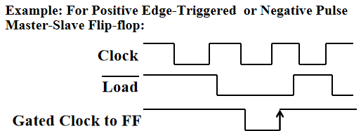

对于电路的搭建，很显然可以设置新的clock=$clock+\overline{Load}$。

但是对于这个比较简单的电路(在时钟上加一个或门)，或门产生了时钟延迟，这样就出现了时钟信号不同步的情况，对于同步时序电路，这是我们不希望出现的。

所以更实用的方法是使用选择器，将当前寄存器输出返回到输入端，通过Load信号选择本位输入(更新)或是当前寄存器的值(保持)。

### Register Transfer Operations

寄存器接收新数据本质山就是寄存器传输，把某个寄存器的值经过计算后传输给另一个寄存器。

几个基本的部分：

- 多个寄存器(源寄存器，目的寄存器)

- 传输方向+计算(operations：load,count,shift,add,or,etc.称作microoperations), 通常用组合逻辑电路实现。

- 控制条件：什么时候要做啥运算，传给谁。

#### Register Notation

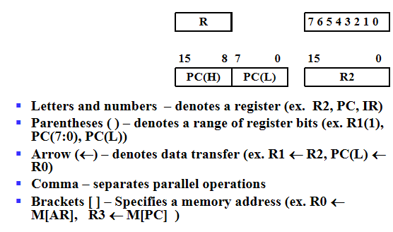

其中$M[AR]$中[]代表寻址。就像C语言中的`*`。其中PC(Program Counter)，是当前执行指令的内存位置。

#### Conditional Transfer

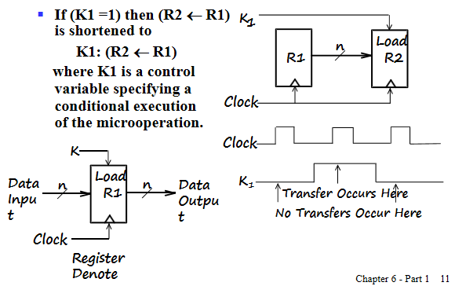

需要注意的点：

- 对于$R_2$寄存器，输入端是一直有信号的(数据是一直准备好的)，但是没有$Load$信号是不会接受的。Load信号控制的是是否接受，而不是是否传递。

- 并不是Load一变为1，R2就开始接收新数据的。R2内部本质是个触发器，接受新数据也要等到时钟的上升沿。

#### Control Expressions

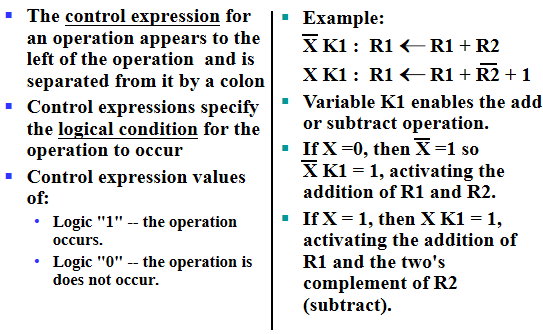

### Microoperations - arithmetic,logic,and shift

有一个注意的点，在冒号左边的加号代表逻辑或;在冒号右边的加号代表算术加。

#### Arithmetic Microoperations

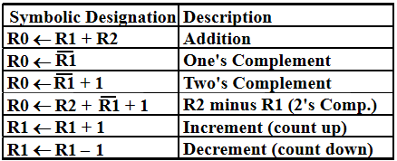

#### Logical Microoperations

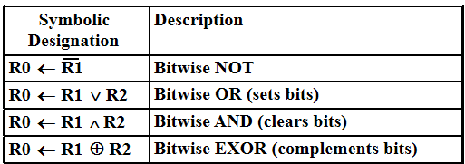

#### Shift Microoperations

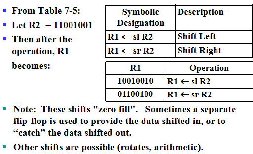

### Register Transfer Structures

#### Multiplexer-Based Transfers

当$K_1$满足时，用$R_1$更新$R_0$
当$K_2\overline{K_1}$满足时，用$R_2$更新。

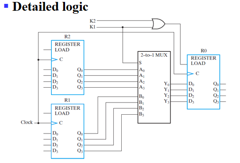

对于更一般的使用多路复用器进行寄存器传输的架构如下图所示：

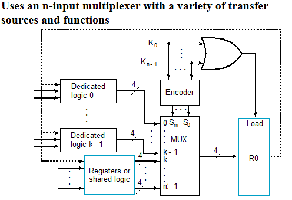

其中选择控制端做了个编码器，$n$位控制信号实现$m$位选择控制端。

#### Register Cell Design

做单位的设计，最后进行拼接(注意考虑边界条件)。

**Specifications**

#### Multiplexer and Bus-Based Transfers for Multiple Registers

现在我们具体看一下使用多路复用器的寄存器传输架构。

如上图所示，我们在每个寄存器前都加一个选择器，$n$个寄存器，对应的就是$n-1$选1多路选择器。该电路可以实现任意两个寄存器的相互传输。

注意到该电路可以实现两个寄存器值的相互交换。例如，我们要交换$R_0,R_1$寄存器的数据。我们将$S_0$置为0，则第一个复用器选择$R_1$的输出信号，同理将$S_1$置为0，选择$R_0$的输出信号。这时候我们同时将$L_0,L_1$置为1，则可以实现两个寄存器的相互传输。

这时候就产生一个问题：在编程语言中，我们交换两个变量的值，一定是通过第三个变量(tmp)进行交换的，但是在这个电路中允许同时交换，即在硬件层面是可行的，但是为什么实际上不支持这样的指令呢？

原因就在于成本。该电路每一个寄存器前都有一个多路复用器，门输入成本太大了。而计算机中存在非常多的寄存器，如果使用该种电路那么开销不可想象。

因此我们简化电路，代价就是寄存器传输的限制。

**Multiplexer Bus**

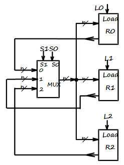

我们使用了公用的多路复用器，选择源寄存器，将它的结果通过选择器得到(即总线的数据)，什么时候我们想要传输，就把相应的寄存器的load信号置为1。由于我们只有一根总线，所以一次只能传输一个数据，无法做到两个变量同时交换。

**Three-State Bus**

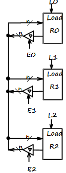

另一种方式是使用三态门。回忆一下三态门，输出有三种状态：0，1，高阻态。当输出为高阻态时相当于电路断开。通过使能信号来控制三态门是否接入电路。

如上图所示，将三个寄存器输出接到同一个总线上，例如我们要把$R_0$传给$R_1$，我们只需将$E_0$使能，并将$L_1$信号拉高即可实现。

该电路除了减少成本外，还有一个优点：假设我们将该电路封装，每个寄存器对应一个数据引脚，因此总共只有$n$个数据引脚(每个引脚对应着双向的数据in,out)。在我们做板极设计时(即设计成芯片)，可以显著减少芯片面积。

#### Shift Registers

下图所示的是一个简单的右移移位寄存器。

!!! Question

    移位寄存器只能使用触发器，不能使用锁存器。

移位寄存器常用的功能是并行加载数据(即设置初值)，最基本的思路是在每个触发器之前放一个多路复用器，通过控制信号选择移位或是加载外部数据。在上图的例子中，`Shift`为0，则选择外部输入，否则进行右移。

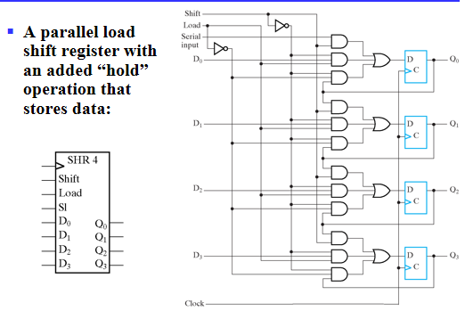

除此之外，我们使用三选一选择器，增加一个Hold选项，实现数据保持不变的功能。若`Shift`为1，此时Load信号对应的门被禁止，进行移位；若`Shift`为0，移位相关的与门被禁止，`Load`信号控制的门被使能。此时根据`Load`为0或1来决定电路是Hold还是外部加载。

我们还可以实现具有选择Load,Hold功能的双向移位寄存器，原理类似，不再赘述。

## Counters, register cells, buses, serial operations

### Counters

对于一个$n$位的序列，计数器可以实现循环的计数。最简单的计数器是二进制计数器，除此之外还有格雷码计数器等。

#### Ripple Counter

(纹波计数器)

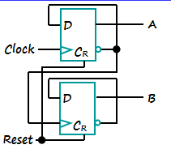

纹波计数器的电路如上图所示，将本位的反向输出提供到本位的输入上，即每个周期取一次反。这样子可以使本位的输出是时钟频率的一半，实现二分频的功能。

在理解了二分频之后，我们将A的输出作为B的时钟信号输入，并将B的反向输出作为B的输入，这样就又实现了二分频。

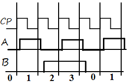

仔细观察波形图，可以发现在B的一个周期内，AB实现了一个从00，01，10，11的计数器。

因此我们可以采取这种方法设计$n$位计数器，并同时也实现了时钟二分频的功能。

但是纹波计数器不是同步的，时钟信号的改变并不统一。我们可以通过以下的例子来看到该问题的影响。

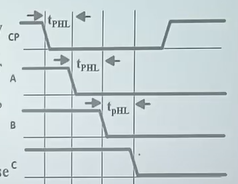

我们考虑0-7的计数器，当计数器为111时，由上图可以看出，并不会直接从7变为0，而是经历了7-6-4-0的错误数据。

这个电路的可取之处在于，我们注意到高位的触发器是不太容易被触发的，因此降低了电路的功耗。

#### Synchronous Counters

同步计数器由一个D触发器和一个自增器构成。

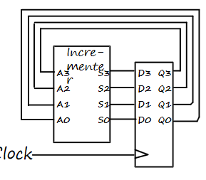

即将本位输出经过自增器加一后给到本位输入。

对于自增器的设计，观察真值表我们可以发现一个规律(高位变换的条件)：

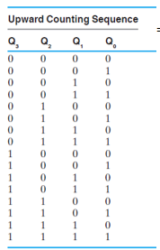

即当低位全部为1时，高位求反。因此可以得到电路实现：

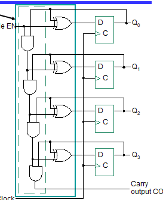

异或门一端接到本位，若符合条件则求反。可控条件我们使用了与门链，依次将低位数据求与，若全为1则异或门求反，否则异或门的结果就是本位保持不变。

该电路的缺点就是与门链的延迟，解决方案的思路与第三章的加法器类似，look ahead,把所有的低位信号全部拉到本位，使用多输入与门。

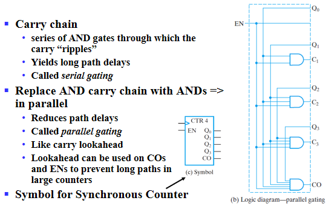

其中`CO`carry out是进位信号,当低位全为1时`CO`为1。
这个进位信号的作用就在于计数器的级联，我们将该4位计数器的进位信号连到另一个计数器(高位)的使能信号，在下一个时钟周期，高位开始计数，低位全部变回0。

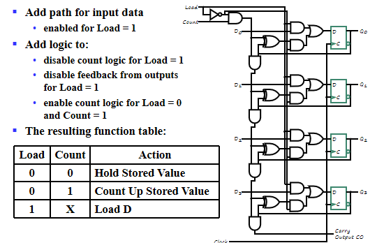

并行加载的计数器。思路与之前寄存器传输一致，这里不展开。

#### Counting Modulo N

除了采用时序电路的方法外(第四章)，我们可以使用二进制计数器来实现模n计数器。方法就是在二进制计数器到达$N-1$时对计数器进行清零。

而Clear有两种方法，一种是ch4介绍的direct input Reset，这种清零是异步的。另一种方法是同步的，当clear信号有效时，不会立马清零，而是等到下一个时钟上升沿同时清零。

!!! Example "Counting Modulo 7"

    - 异步清零方法：

    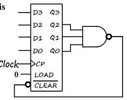

    如图所示，当计数器输出为7时，立即clear，电路的输出会有很短时间的7出现。

    - 同步清零方法：

    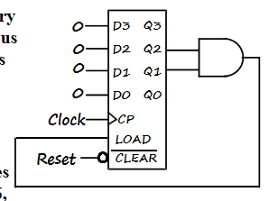

    这时候我们在检测到6时，与门输出结果变为1(很显然当输出为0-5时与门输出都为0)，该信号传递到Load端，但是并不会马上加载，而是在下一个上升沿到达后，加载外部信号0000，实现了并行加载的同步清零。

    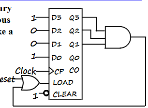

    我们也可以设计中间结果的模N计数器，如上图所示，复习的时候可以分析一下该电路功能。

### Serial transfers and microoperations

串行每次运算一个位，因此速度比较快。降低了电路复杂度。

**Serial Adder**

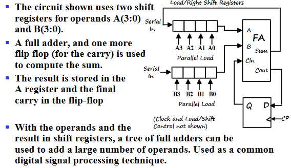

!!! Example "习题"

    - Using two binary counters of the type shown in Figure 6-14 and logic gates, construct a binary counter that counts from decimal 11 through decimal 233. Also, add an additional input and logic to the counter to initialize it synchronously to 11 when the signal INIT is 1.

    首先需要清楚binary counter的结构。之后使用同步清零方法即可实现。示例电路如下：

    

    - Two register transfer statements are given(otherwise, $R_1$ is unchanged):

    $C_1:R_1\leftarrow R_1+R_2$
    $\overline{C_1}{C_2}:R_1\leftarrow R_1+1$

    Using a 4-bit counter with parallel load as in Figure 6-14 and a 4-bit adder as in Figure 4-5, draw the logic diagram that implements these register transfers.

    Repeat part (a) using a 4-bit adder as in Figure 3-43 plus external gates as needed. Compare with the implementation in part (a).

    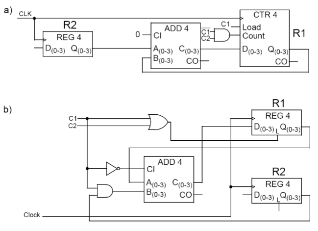
