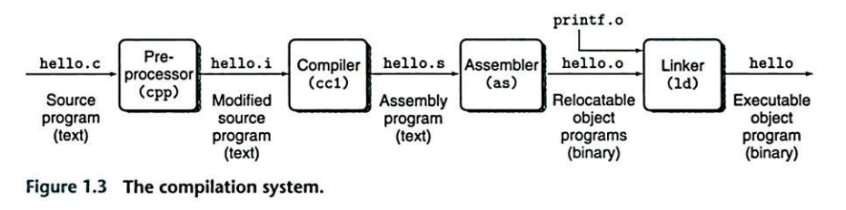

# 计算机系统漫游

## 信息是 bit + context

我们来跟踪 `hello` 程序的生命周期。

- `hello` 程序的生命是从一个源程序开始的。源程序实际上是一个由 0 和 1 组成的位序列。 8 个一组，称为字节。
    - 一个基本的思想：系统中所有的信息都是由一串比特表示的。
    - 区分不同数据对象的唯一方法是我们读到这些数据对象时的上下文。

## 程序被其它程序翻译成不同的格式

为了在系统上运行 `hello.c` 程序，每条 C 语句都必须被其它程序转化为一系列的低级机器语言指令。这些指令按照一种称为可执行目标程序的格式打包好，并以二进制磁盘文件的形式存放起来。目标程序也称为可执行目标文件。

- 预处理阶段：预处理器根据以字符 `#` 开头的命令修改原始的 C 程序(直接插入到程序文本中)，得到另一个 C 程序，通常以 `.i` 作为文件扩展名，
- 编译阶段：编译器将文本文件 `hello.i` 翻译成 `hello.s`， 它包含一个汇编语言程序。汇编语言程序中的每条语句都以一种标准的文本格式准确地描述了一条低级机器语言指令。汇编语言为不同高级语言的不同编译器提供了通用的输出语言。
- 汇编阶段: 汇编器将 `hello.s` 翻译成机器语言指令，把这些指令打包成可重定位目标程序的格式，并将结果保存在目标文件 `hello.o` 中。`hello.o` 是一个二进制文件，它的字节编码是机器语言指令而不是字符。
- 链接阶段：举个例子，我们的 `hello` 程序调用了 `printf` 函数，它是标准 C 库中的一个函数，它存在于 `printf.o` 的单独的预编译目标文件中，而这个文件必须以某种方式并入到我们的 `hello.o` 程序中。链接器就负责处理这种并入，最后得到 `hello` 文件，它是一个可执行目标文件(可执行文件)，可执行文件加载到存储器后，由系统负责执行。

## 了解编译系统如何工作的益处

- 优化程序性能。
- 理解链接时出现的错误。
- 避免安全漏洞。

## 处理器读并解释存储在内存中的指令

### 系统的硬件组成

#### 总线

- 贯穿整个系统的是一组电子管道，称作总线。它携带信息字节并负责在各个部件间传递。
- 总线通常被设计成传送定长的字节块(word), 字中的字节数是一个基本的系统参数。

#### I/O 设备

I/O 设备是系统与外部世界的联系通道。每个 I/O 设备都通过一个控制器或适配器与 I/O 总线相连。

#### 主存

主存是一个临时存储设备，在处理器执行程序时，用来存放程序和程序处理的数据。
