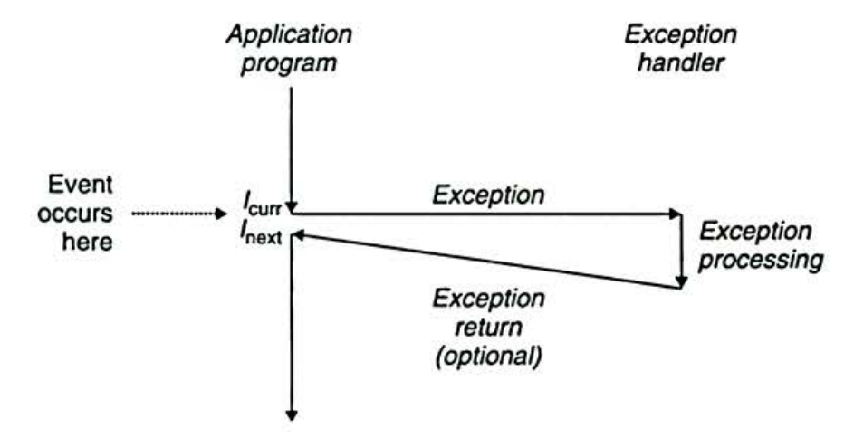
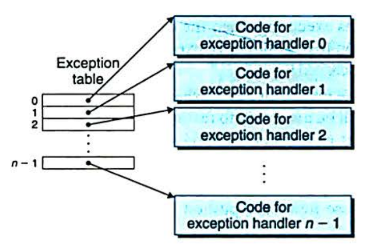
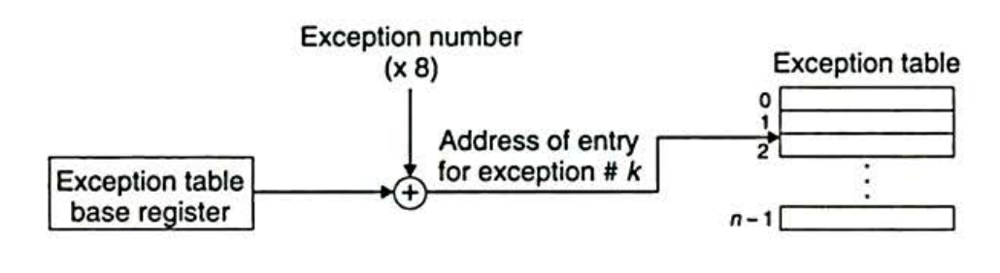
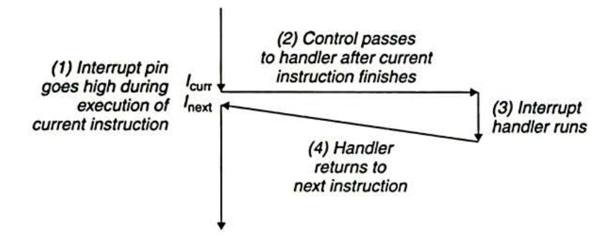
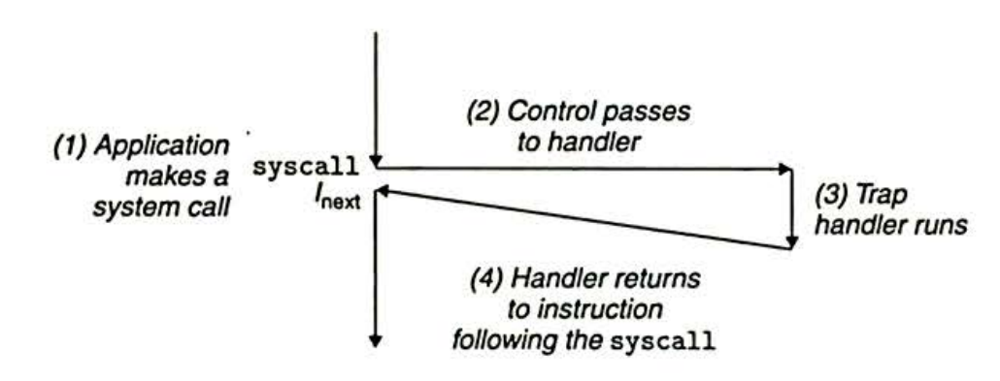

# 异常控制流

从给处理器加电开始直到断电为止，程序计数器假设一个值的序列 $a_0,a_1,\cdots,a_{n-1}$，其中每个 $a_k$ 是某个相应指令 $I_k$ 的地址。每次从 $a_k$ 到 $a_{k+1}$ 的过渡称为控制转移。这样的控制转移序列叫做处理器的控制流。

当每个 $I_k$ 和 $I_{k+1}$ 在内存中是相邻的，则称这种控制流是平滑的，否则会存在突变，突变通常由跳转、函数调用、返回等指令造成的。但有时系统状态也会发生变化，现代系统通过使控制流发生突变来对这些情况做出反应。一般而言，我们把这些突变称为**异常控制流**(ECF)。

## 异常

异常就是控制流中的突变，用来响应处理器状态中的某些变化。

如上图所示，当处理器状态中发生一个重要的变化时，处理器正在执行某个当前指令 $I_{curr}$。状态变化称为**事件(event)**。事件可以和当前执行的指令相关(虚拟内存缺页、算术溢出)，也可以无关(系统定时器产生信号，I/O 请求完成)。

当处理器检测到事件发生时，它会通过一张异常表(exception table), 进行一个间接过程调用，到一个专门设计用来处理这类事件的操作系统子程序(异常处理程序 exception handler)。

### 异常处理

- 系统每种类型的异常都分配了一个唯一的非负整数异常号(excpetion number)。其中一些号码是由处理器的设计者分配的(被零除、缺页、内存访问违例、算术溢出等)，其它号码是由操作系统内核的设计者分配的(系统调用，外部 I/O 设备信号)。
- 系统启动时，操作系统分配和初始化一张称为**异常表**的跳转表。表目 $k$ 包含异常 $k$ 的处理程序的地址。

- 运行时，处理器检测到发生了一个事件，并且确定了相应的异常号 $k$。随后，处理器触发异常，通过异常表的表目 $k$ 转到相应的处理程序。
    - 异常号是到异常表中的索引。
    - 异常表的起始地址放在**异常表基址寄存器**的特殊 CPU 寄存器中。

- 异常类似于过程调用, 但有一些不同:
    - 根据异常的类型, 返回地址要么是当前指令(事件发生时正在执行的指令), 要么是下一条指令.
    - 处理器把一些额外的处理器状态压到栈里, 在处理程序返回时, 重新开始执行被中断的程序也需要这些状态.
    - 如果控制从用户程序转移到内核, 所有这些项目被压到内核栈中, 而不是用户栈.
    - 异常处理程序运行在内核模式下, 对所有的系统资源有完全的访问权限.
- 一旦硬件触发了异常，剩下的工作就是由异常处理程序在软件中完成。

### 异常的类别

- 中断
    - 异步发生，来自处理器外部 I/O 设备的信号的结果。
    - 
    - I/O 设备通过向处理器芯片上的一个引脚发送信号，并将异常号放到系统总线上来触发中断。这个异常号标识了引起终端的设备。
    - 当前指令执行完之后，处理器注意到终端引脚的电压变高了，就从系统总线上读取异常号，调用相应的中断处理程序。
    - 处理程序返回时，将控制返回给下一条指令。
- 陷阱(Trap)
    - 陷阱是有意的异常，是执行一条指令的结果。
    - 最重要的用途是在用户程序和内核之间提供一个像过程一样的接口，称作**系统调用**。
        - 用户程序经常需要向内核请求服务(读文件，创建进程，加载程序，终止进程等)
        - 用户想要请求服务 $n$ 时，执行 `syscall n` 指令。
        - 导致一个到异常处理程序的 trap，这个处理程序解析参数并调用适当的内核程序。
    - 
- 故障
    - 由错误情况引起，可能能够被故障处理程序修正。
    - 故障发生时，处理器将控制转移给故障处理程序。
        - 如果能修复错误情况，返回引起故障的指令，重新执行。
        - 否则返回到内核中的 abort 例程，终止该程序。
- 终止
    - 不可恢复的致命错误造成的结果，通常是一些硬件错误(DRAM/SRAM 位损害发生的奇偶校验异常)
    - 终止处理程序将控制返回给 abort 例程。

## 进程

