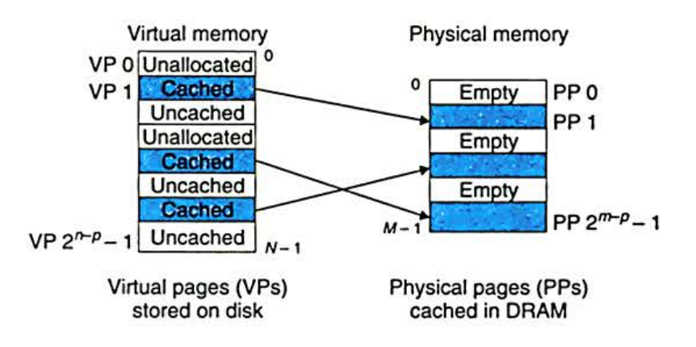
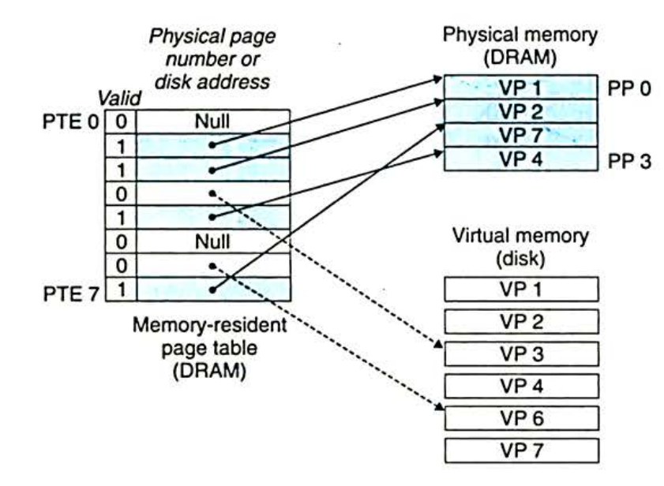

# 虚拟内存

一个系统中的进程是与其它进程共享 CPU 和主存资源的。但是共享主存会存在一些问题：

- 进程太多，需要很多内存，那么有些进程就无法运行。
- 某个进程可能不小心写入另一个进程使用的内存。

所以为了更加有效地管理内存，我们提出一种对主存的抽象概念：**虚拟内存**。它为每个进程提供了一个大的、一致的、私有的地址空间。下面是几个 High Level Idea:

- 它将主存看成是一个存储在磁盘上的地址空间的高速缓存，在主存中只保存活动区域，并根据需要在磁盘和主存之间来回传送数据。
- 它为每个进程提供了一致的地址空间，从而简化内存管理。
- 保护了每个进程的地址空间不被其它进程破坏。

## 物理和虚拟寻址

计算机的主存被组织为一个由 $M$ 个连续字节大小的单元组成的数组，每个字节都有一个唯一的物理地址(Physical Address, PA)。第一个字节的地址为 0 ，接下来为 1，2 等等。 CPU 访问内存最自然的方式就是使用物理地址，这种方式为 **物理寻址**。

如上图所示，当 CPU 执行 load 指令时，会生成一个有效物理地址，通过内存总线把它传递给主存，主存取出从物理地址 4 处开始的 4 字节字，并将它返回给 CPU。

而对于虚拟寻址的方法， CPU 通过生成一个虚拟地址(VA)来访问主存，这个虚拟地址在被送到内存之前先转换成适当的物理地址。将一个虚拟地址转换为物理地址的任务叫做地址翻译。CPU 芯片上有个专用硬件(内存管理单元)，利用存放在主存中的查询表来动态翻译虚拟地址，该表的内容由操作系统管理。

## 地址空间

地址空间时一个非负整数地址的有序集合：$\{0,1,2\cdots\}$.
如果地址空间中的整数是连续的，那么我们说它是一个线性地址空间。(为了简化讨论，我们总是假设使用的是线性地址空间)。

在一个带虚拟内存的系统中，CPU 从一个有 $N=2^n$ 个地址的地址空间生成虚拟地址，这个地址空间称为**虚拟地址空间** $\{0,1,\cdots,N-1\}$。

一个地址空间的大小是由表示最大地址所需要的二进制**位数**来描述的。一个包含 $N=2^n$ 个地址的虚拟地址空间就叫做一个 $n$ 位地址空间。现代系统通常支持 32/64 位虚拟地址空间。

一个系统还有一个物理地址空间，对应系统中物理内存的 $M$ 个字节，并不要求是 $2$ 的幂。

!!! note

    地址空间的概念区分了数据对象(字节)和它们的属性(地址)。这样就允许我们让每个数据对象具有多个独立的地址，其中每个地址都选自一个不同的地址空间。这就是虚拟内存的基本思想，主存中的每个字节都有一个选自虚拟地址空间的虚拟地址和一个选自物理地址空间的物理地址。

## 虚拟内存：作为缓存的工具

虚拟内存被组织为一个由存放在磁盘上的 $N$ 个连续的字节大小的单元组成的数组，每个字节都有一个唯一的虚拟地址作为到数组的索引。磁盘上数组的内容被 cached 在主存中。VM 将虚拟内存分割为虚拟页(搬运的一个块)，任意时刻虚拟页的集合都分为如下三个不相交的子集：

- 未分配：VM 系统还未分配的页，没有任何数据和它们相关联，因此不占用磁盘空间。
- 缓存的：已经缓存在物理内存中的分配页。
- 未缓存的：未缓存在物理内存中的已分配页。

### DRAM 缓存的组织结构

- SRAM： CPU 和主存之间的高速缓存。
- DRAM：虚拟内存的缓存，在主存中缓存虚拟页。

需要注意的是，DRAM 缓存的 miss 非常昂贵，DRAM 不命中要由磁盘服务，而磁盘读非常慢。因此虚拟页往往很大，通常是 4KB-2MB，并且 DRAM 缓存是全相联的(任何虚拟页可以放置在任何的物理页)

### 页表

虚拟内存必须有某种方法来判定一个虚拟页是否缓存在 DRAM 的某个地方。如果是，还必须确定这个虚拟页存放在哪个物理页中。如果 miss, 系统要判断这个虚拟页存放在磁盘的哪个位置，并在物理内存中选择一个 victime page 进行替换。

这些功能由软硬件联合提供，包括 os 和 MMU 中的地址翻译硬件，以及一个存放在物理内存中的页表。页表将虚拟页映射到物理页，每次地址翻译硬件将一个虚拟地址翻译成物理地址时都需要读取页表。操作系统负责维护页表，并在磁盘和 DRAM 中传送 page.

如上图所示，页表是一个页表条目(PTE)组成的数组。有效位表明该虚拟页当前被缓存在 DRAM 中，如果有效位为 1， 则地址字段表示 DRAM 中相应物理页的起始位置，该物理页缓存了虚拟页。
