# Instructions: Language of the Computer

## Summary of RISC-V architecture

### RISC-V opoerands

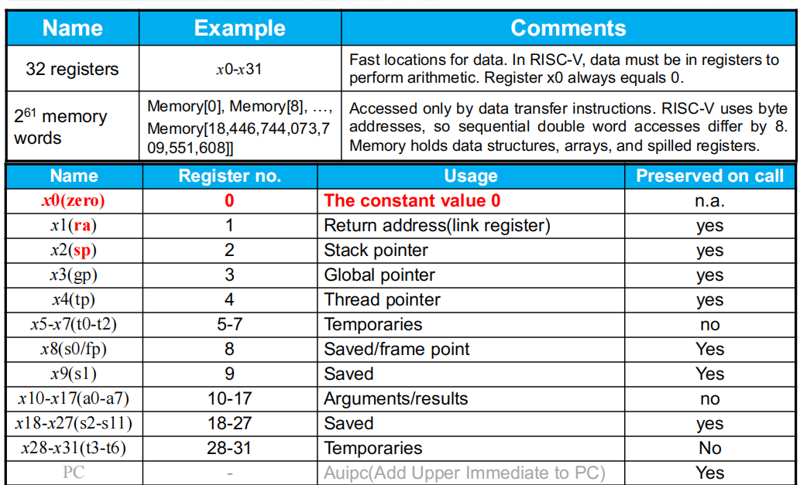

### RISC-V assembly language

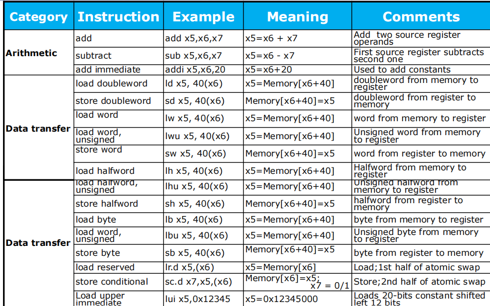

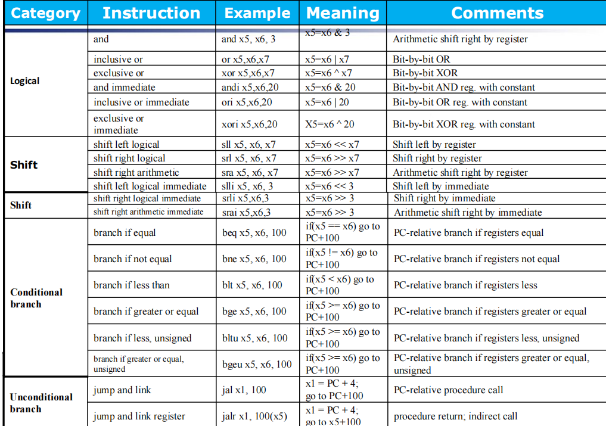

### RISC-V Instruction Format

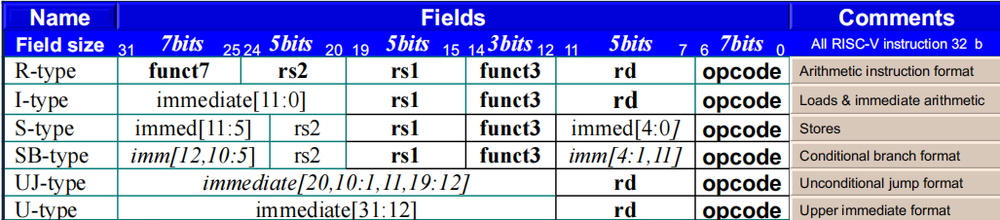

## Supporting Prcedures in Computer Hardware

Six step:

1. Place Parameters in a place where the procedure can access them.
2. Transfer control to the procedure: **jump to**.
3. Acquire the storage resources needed for the procedure.
4. Perform the desired task
5. Place the result value in a place where the calling program can access it.
6. Return control to the point of origin.

### Procedure Call Instructions

- Instruction for procedures: `jal`(jump and link)

**Caller**: `jal x1, ProcedureAddress`

跳转到目标进程的地址，同时将 PC 指针加 4 的值放入寄存器 `x1(ra)` 。

- Procedure return: jump and link register

**Callee**: `jalr x0, 0(x1)`

跳转到 x1 的地址加 0 ，此时我们不需要记住函数的返回地址，因此跳转至无法修改的目的寄存器 `x0`。

- More Registers for procedure calling

`a0-a7`(`x10-x17`): eight argumengt registers to pass parameters and return values.

`ra/x1`: one return address register to return to origin point.

倘若参数个数更多，我们就将参数压栈。

push: sp = sp - 8, pop: sp = sp + 8

!!! Example

    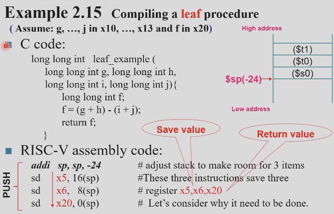

    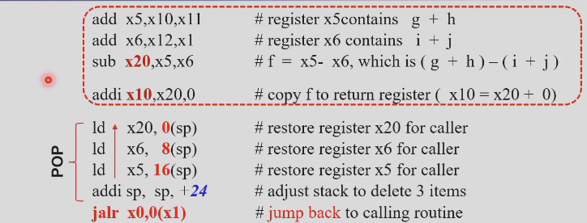

    假设我们使用 x5,x6,x20 三个寄存器分别存储 g + h, i + j, f 的值，由于调用这个进程的程序可能用到这三个寄存器，因此我们需要将这三个寄存器压栈。

    需要注意的是，`addi x10,x20,0` 指令，我们将`x20` 的值存到寄存器 `x10` 中, 因为 x20 不是存放参数的寄存器。

但是观察对应的 RISC-V 指令，我们发现执行这样一个简单的运算前期需要 `sd`，后期需要 `ld`，需要八条指令为运算作准备。因此我们思考，是否能够不用 `x5,x6,x20` 寄存器？

**Two classes of registers**:
  
- `t0-t6`: 7 temporary registers, by the callee not preserved.(即不需要压栈)
- `s0-s11`: 12 saved registers, must be preserved if used.

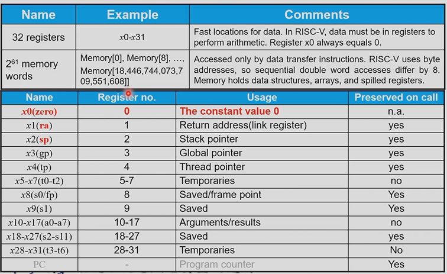

### Nested Procedtures

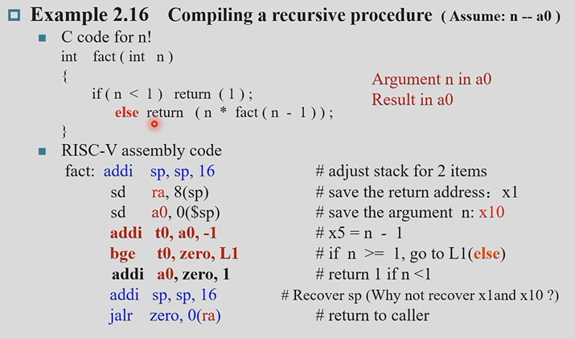

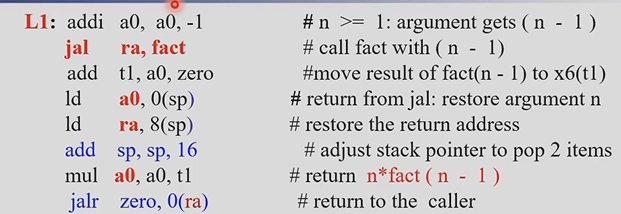

需要注意的是，在递归程序中，第一个存下来的 `ra` 是最后一个用的。并且，变量 n 也是需要不停参与运算的，因此也需要压栈。

!!! Question

    还不是很理解递归的汇编

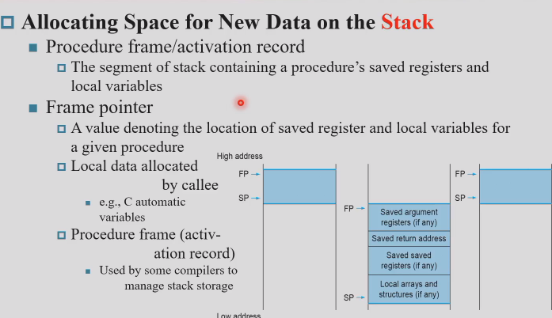

## Communicating with People

### Byte/Halfword/Word Operations

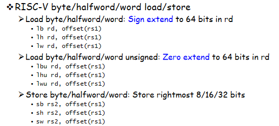

## RISC-V Addressing for Wide Immediate & Addresses

回顾 RISC-V 中的指令格式，基本上只有 12 位来存放立即数。(Make common cases fast)。但是有时候我们也需要使用 32 位的立即数，这时候我们可以使用 `lui` 指令先处理高 20 位。

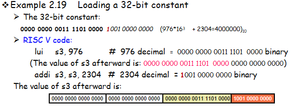

但是上图中有一处错误，我们需要把 `addi` 改成 `ori`。因为 `addi` 中的立即数只能表示 -2048 到 2047 的数。

### Branch Addressing

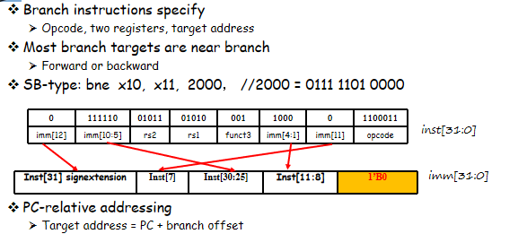

### Jump Addressing

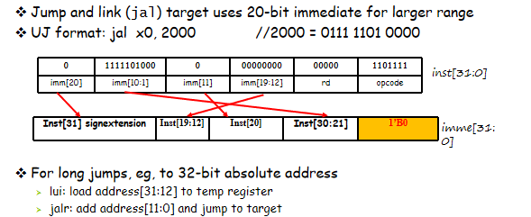

!!! Example

    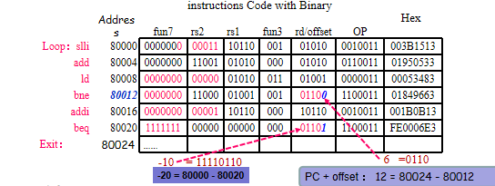

    对于 `bne`，它跳转到的 `Exit` offset 为 12。 但是需要注意的是写入指令的值应该为6，因为立即数的最后一位始终为 0 。

**While branch target is far away**:

如果我们需要跳转到的指令地址太远，超出 `beq` 指令的表达范围，我们可以将条件取反后使用 `jal` 指令跳转：

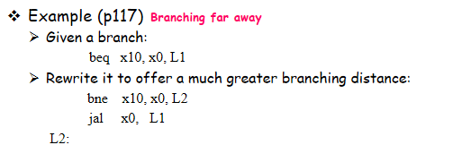

## Translating and starting a program

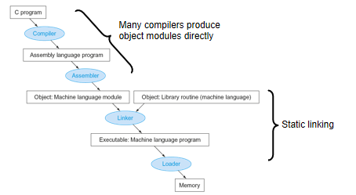

### Object File

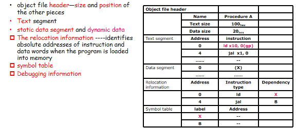

### Link

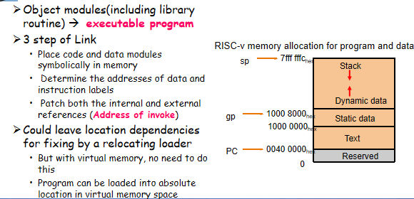

