# Arthimetic for Computer

## Intrduction

- Computer words are composed of bits
    - thus words can be represented as binary numbers
    - there are 32bit/word or 64bits/word in RISC-V
    - Contains four bytes or eight bytes
- Generic Implementation
    - use the PC to supply instruction address
    - get the insturction from memory
    - read registers
    - use the instruction to decide exactly what to do

## Arithmetic

### Multiplication

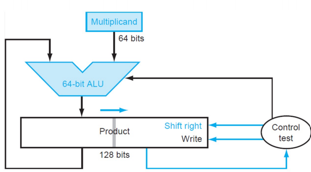

对于 $n$ bit 乘法，首先将乘数放到积寄存器的低位，在每轮迭代中检测积的第 0 位是否为 1，如果是则将积的高位加上被乘数后右移，否则仅做右移操作，迭代 $n$ 轮。

!!! Example

    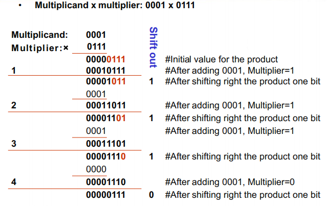

#### Booth's Algorithm

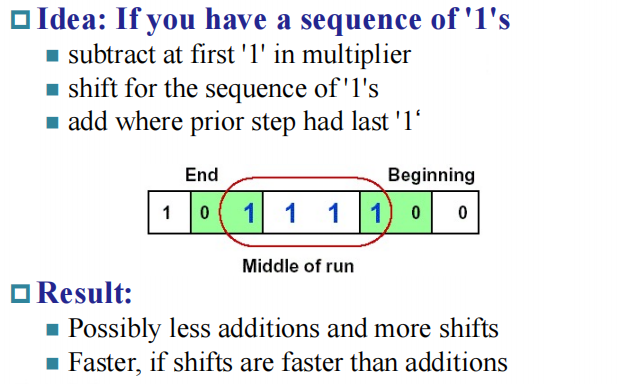

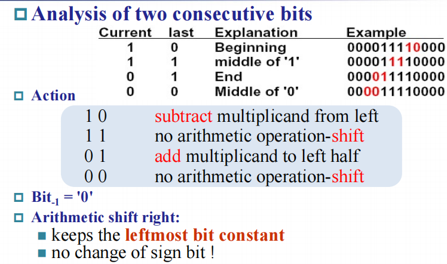

注意移位的时候要保证符号位不变(算术右移)

!!! Example 

    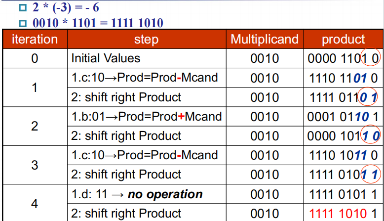

### Division

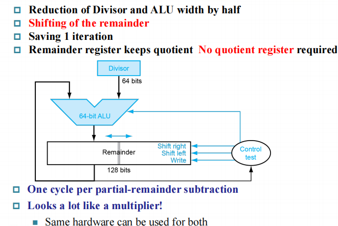

!!! Example 

    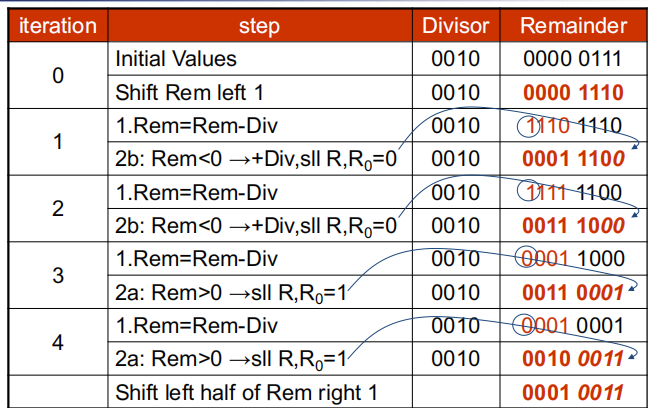

## Floating point numbers

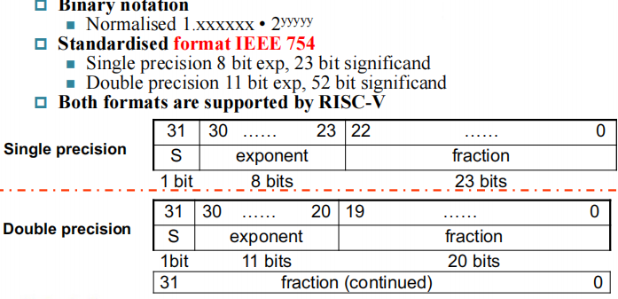

### IEEE 754 standard

- Leading 1 bit of significand is implicit(saves one bit)
- Exponent is biased: (127 for single precision, 1023 for double precision)

$$
(-1)^{sign}\cdot (1+significand) \cdot 2^{exponent - bias}
$$

#### Single-Precision Range

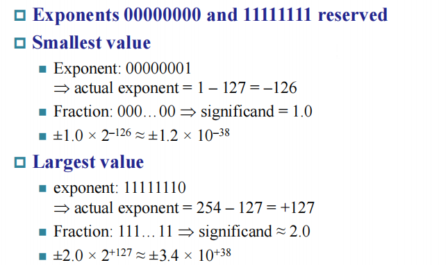

#### Double-Precision Range

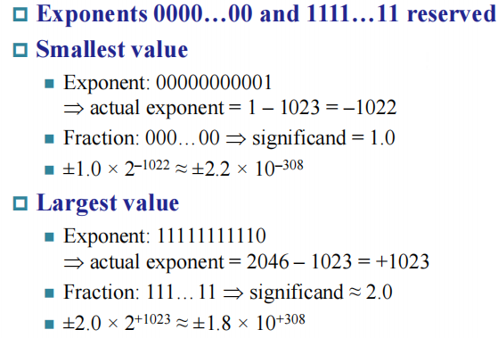

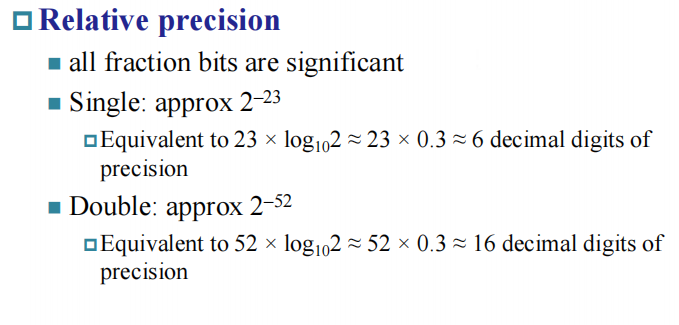

#### Infinities and NaNs

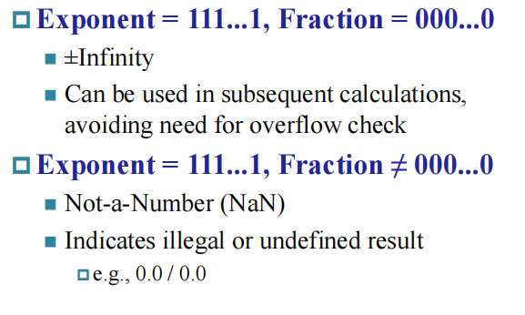

### Floating point addition

- Alignment
- The proper digits have to be added
- Addition of siginificands
- Normalisation of the result
- Rounding

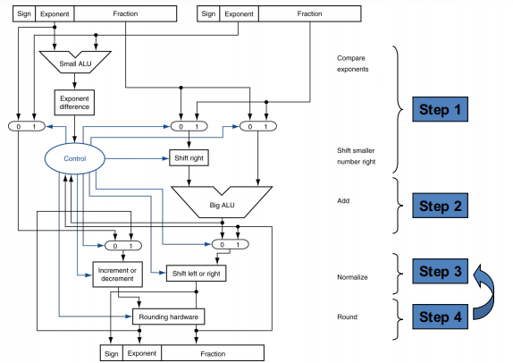

!!! Example 

    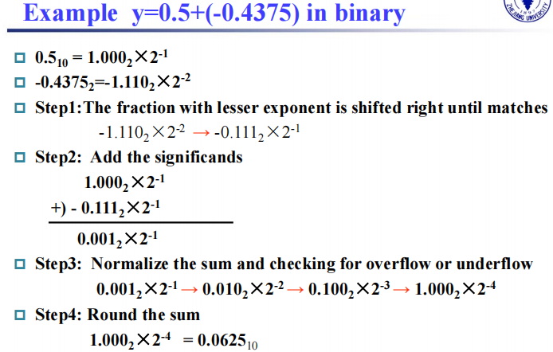

