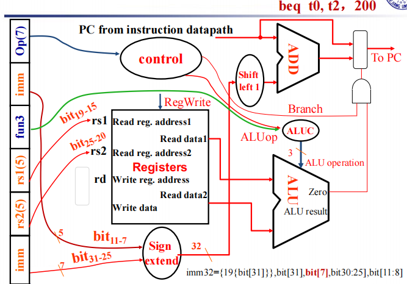

# Processor Design

## Introduction

- CPU performance factors
    - 指令数量：由 ISA 和编译器决定
    - CPI and Cycle Time: Determined by CPU hardware

### Instruction Execution Overview

- For every instruction, the first two step are identical
    - Fetch the instruction from the memory
    - Decode and read the registers
- Next steps depend on the instruction class
    - Memory reference
    - Arithmetic logical
    - branches
- Depending on instruction class
    - Use ALU to calculate: arithmetic result, memory address for load/store, branch comparison
    - Access data memory for load/store
    - PC <- target address or PC + 4

回顾在计逻中介绍的，我们不能直接将两根线连在一起，这时候我们就需要多路选择器来控制 CPU 的传输，综合起来就是一个控制单元。

## Building a Datapath

- Datapath: Elements that process data and adresses in the CPU.

### Instruction execution in RISC-V

### Instruction Fetch

在不考虑跳转的时候，由于 PC 没有控制信号，每个时钟周期都加 4。

**R-Format Instructions**

寄存器的模块中，读取没有控制信号，写有控制信号。对于 R-Format 的指令，我们将从寄存器中读取的数据经过 ALU 计算，将结果写入 Register。

**Load/Store Instructions**

上图右侧的立即数扩展单元，由于 Load/Store 需要用 ALU 进行地址计算，但 ALU 是 64 位的，因此我们需要将 12 位的立即数扩展成 64 位。

**Branch Instructions**

其中左移一位的原因是：注意到我们 PC 相对寻址，是将 PC 指针加上立即数乘以 2 (指令中存储的立即数是没有第 0 位的)。

**Composing the Elements**

由于我们整个过程都需要在一个时钟周期内完成，而 datapath 中的每一元件只能一次计算一个 function，因此我们将指令内存和数据内存分开。

### Path Built using Multiplexer

#### R type Instruction & Data Stream

首先根据指令读取两个源寄存器和一个目的寄存器，经过寄存器单元得到源寄存器的数据，送到 ALU 计算单元。根据指令中的 opcode 决定进行 ALU 运算， 根据 fun3 和 fun7 决定进行哪种 ALU 运算，最后 ALU 运算结果写入目的寄存器中。

#### I type Instruction & Data Stream

首先根据指令读取两个寄存器，经过寄存器单元得到源寄存器的数据。根据指令读取立即数，并经过立即数扩展单元将 12 位立即数扩展成 32 位，与寄存器中的数据经过 ALU 运算得到内存地址，送入 Memory 中得到数据，最后写入目的寄存器中。

#### S type Instruction & Data Stream

需要注意的是 `sw` 指令是没有最下面写进寄存器的数据通路的。

#### SB type Instruction & Data Stream

首先将指令中两个寄存器的值取出来，经过寄存器单元得到相应数据，通过 ALU 进行比较。其次将指令中的立即数取出，通过立即数扩展单元并左移一位后与 PC 相加，最后根据 ALU 的计算结果判断是否跳转。

#### Jal type Instruction & Data Stream

需要注意的是上图没有将 PC + 4 的值存在寄存器中。

**R-Type/Load/Store Datapath**

**Full Datapath**

现在我们需要决定选择信号的值，这时候就需要控制单元。

## A simple Implementation Scheme

Analyse for cause and effect

- Information comes from the 32 bits of instruction
- Selecting the operations to perform(ALU, read/write, etc.)
- Controlling the flow of data(multiplexor inputs)
- ALU's operation based on instruction type and function code.

### ALU Control

ALU used for:

- Load/Store: F = add
- Branch: F = subtract
- R-type: F depends on opcode

**Scheme of Controller**

知道 opcode 之后大部分控制信号都已经定下来了, 仅对于 R-type 指令我们需要根据 function code 进一步判断进行哪种操作，因此我们对控制信号做两级解码。

### Designing the Main Control Unit(First Level)

我们先进行第一层解码，通过指令的 opcode 将控制信号分为三大类：ALU operation, Mux, R/W。进一步我们将 ALU op 解码成 2 位，如上图所示。

因此我们可以根据 opcode 得到所谓的真值表。

### Design the ALU Decoder(Second Level)

ALU operation is decied by 2-bit ALUOp derived from opcode, and funct7 & funct3 fields of the instruction.

**Datapath with Control**

## Pipelining

首先我们假设 Memory 访问需要 200ps, ALU 和加法器需要 200ps, 访问 register file 需要 100ps, 则对于单周期 CPU 各种操作的时间如下表所示：

我们可以发现每一种指令执行的时间实际上是不一样的。因此对于单周期 CPU，我们只能选取最长的时间作为时钟频率。考虑实际应用中，`ld` 指令其实相对比较少(总不可能一直在访问 Memory ), 因此降低了 CPU 的性能。

总结如下：

- Longest delay determines clock period
    - Critical path: load instruction
- Not feasible to vary period for different instructions
- Violates design principle: making the common case fast

因此我们引入流水线的概念来提升性能。

### RISC-V Pipeline

**Five stages, one step per stage**

1. IF: Instruction fetch from memory
2. ID: Instruction decode & register read
3. EX: Execute operation or calculate address
4. MEM: Access memory operand
5. WB: Write result back to register
7

### Pipeline Speedup

- If all stages are balanced(all take the same time):
    - Time between instructions = Nonpipelined / Number of stages
- If not balanced, speedup is less
- **Speedup due to increased throughput, latency(time for each instruction) does not decrease**

### Pipelining and ISA Design

**RISC-V ISA designed for pipelining**

RISC-V 的架构很适合流水线加速：

- All instructions are 32 bits, easier to fetch and decode in one cycle.
- Few and regular instruction formats
    - can decode and read registers in one step.
- Load/store address
    - can calculate address in 3rd stage, access memory in 4th stage.

但是流水线也存在问题：试想一种情况，一条指令需要用到上一条指令存到寄存器的数据作为操作数，但是上一条指令 `WB` 在第五个时钟周期完成，而该指令在第二个周期就要执行，造成错误。

### Hazards

- Situations that prevent starting the next instruction in the next cycle.
- Structure hazards
    - A required resource is busy(一条指令处在 ID，另一条指令处在 WB，有可能出现结构竞争)
- Data hazard
    - Need to wait for previous instruction to complete its data read/write
- Control hazard
    - Deciding on control action depends on previous instruction

#### Structure Hazards

In RISC-V pipeline with a single memory

- Load/Store requires data access
- Instruction fetch would have to stall for that cycle
    - Would cause a pipeline "bubble"

#### Data Hazards

解决方案是在两条指令中插 bubble，这时 WB 和 ID 在同一个地方，我们只需在前半个时钟写入(时钟下降沿写)，后半个时钟读即可。

**Forwarding**

但是这种情况经常发生，如果一直插 bubble 的话，流水线加速的意义就不是很明显了。
注意到上图中，add 的结果在 EX 步骤就得到了，实际上是不需要经过 MEM 的，这时我们采用 Forwarding 的方法，如下图所示：

但如果前面是个 load 指令，需要在 MEM 访问完之后才得到数据，因此必须插一个 bubble，如下图所示：

或者我们可以 reschedule code to avoid stalls：

#### Control Hazards

- Branch determines flow of control
    - Fetching next instruction depends on branch outcome
    - Pipeline can't always fetch correct instruction(still working on ID stage of branch)
- In RISC-V pipeline
    - Need to compare registers and compute target early in the pipeline
    - Add hardware to do it in ID stage

**Pipeline Summary**

- Pipelining improves performance by increasing instruction throughput.
- Subject to hazards.
- Instruction set design affects complexity of pipeline implementation.

### RISC-V Pipelined Datapath

**Pipeline registers**

流水线填满的时候，每个 stage 执行的都是不同的指令，因此我们需要流水线寄存器存储指令。

!!! Example 

    

    对于 load 指令的 WB 阶段，我们不能直接写回 register，因为此时的控制信号与写回地址是处在 IF/ID 寄存器中的指令。因此我们需要保存该指令的相关信号，如图中蓝线所示。

**Multi-Cycle Pipeline Diagram**

**Single-Cycle Pipeline Diagram**

#### Pipelined Control

### Data Hazards

首先需要注意的是，并不是只有相邻指令才需要 forwarding 的，需要画出 multi diagram 判断，如上图所示。

并且第一条指令与第二、三条是有数据竞争的，与后面两条指令并不冲突。

#### Detecting the Need to Forward

我们在每一级的寄存器中都会有编号：
`ID/EX.RegisterRs1`: register number for rs1 sitting in ID/EX pipeline register.

- ALU operand register numbers in EX stage are given by `ID/EX.RegisterRs1, ID/EX.RegisterRs2`.
- Data hazards when:
    - EX/MEM.RegisterRd = ID/EX.RegisterRs1
    - EX/MEM.RegisterRd = ID/EX.RegisterRs2
    - MEM/WB.RegisterRd = ID/EX.RegisterRs1
    - MEM/WB.RegisterRd = ID/EX.RegisterRs2

但是只有需要写回寄存器的指令需要 forwarding：

- EX/MEM.RegWrite, MEM/WB.RegWrite
- EX/MEM.RegisterRd 和 MEM/WB.RegisterRd 不是 `x0`。

**Forwarding Paths**

**Double Data Hazard**

!!! Question "Revised Forwarding Condition"

    不是很理解

#### Load-Use Hazard Detection

**How to Stall the Pipeline**

**Stalls and Performance**

- Stall reduce performance, but are required to get correct results.
- Compiler can arange code to avoid hazards and stalls.

### Branch Hazards

一个很直观的想法就是把中间三条指令 flush 掉，但是这样我们就要等比较长的时间，因此我们考虑 reducing branch delay:

Move hardware to determine outcome to ID stage

- Target address adder
- Register comparator

!!! Example "Branch Taken"

    

    在 ID 阶段判断是否跳转，如果跳转，则将当前处在 IF 阶段的指令 flush, 产生一个 bubble, bubble 过后直接执行跳转指令。

    

但是对于拆得更深的流水线(这里我们举的例子都是五级流水线，即将一条指令的 datapath 拆成五个阶段)，使用上述的方法会增加代价。

**Dynamic Branch Prediction**

- Branch prediction buffer(branch history tabel)
- Indexed by recent branch instruction addresses
- Stores outcome(taken/not taken)
- To execute a branch
    - Check table, expect the same outcome
    - Start fetching from fall-through or target
    - If wrong, flush pipeline and flip prediction

即建立一个索引表，存的是上次分支指令时是否命中，当前指令根据表中信息决定是否跳转，若不命中则更新表。

但是对于双层循环会存在问题：

**2-Bit Predictor**

**Only change prediction on two successive mispredictions**

Even with predictor, still need to calculate the target address, resulting in 1-cycle penalty for a taken branch.

Branch targte buffer:

- Cache of target addresses
- Indexed by PC when instruction fetched

只存最新用的。

## CPU within Exception

### Exception(Interruption)

- The cause of changing CPU's work flow:
    - Control instructions in program(bne/beq, j/jal, etc.), which is **foreseeable** in programming flow.
    - Something happen suddenly(Exception and Inerruption), which is **unpredictable**
- Unexpected events:
    - Exception: from within processor(overflow, undefined instruction, etc.)
    - Interruption: from outside processor(input/output)

#### How Exceptions are handled?

- What must the processor do?
    - When exception happens, the processor must do something.
    - The predefined process routines are saved in memory when computer starts. (提前写好了程序)
- Problem:
    - How can CPU go to relative routine when an exception occurs
    - CPU should know: the cause of exception and which instruction generate the exception

### RISC-V Privileged

### RISC-V interrupt structure

- 所有的硬件实现必须提供 M-mode
    - as this is the only mode that has unfettered access to the whole machine.
    - The simplest RISC-V implementations may provide only M-mode.
- Machine mode most important task
    - to intercept and handle interrupts/exceptions
    - There are 4096 Control and Status Registers(CSRs)

#### CSRs

CSR 寄存器是专门用来处理中断/异常的寄存器，要用特权指令来访问。
这些指令可以分为两类：原子操作(read-modify-write, 一步完成)的指令和其它特权指令。

**CSR Instruction**

CSR 指令是专门用来更新 csr 寄存器的。

- CSRRW: 将 csr 的值读到 rd 寄存器，同时把 rs 的值更新到 csr 中。
- CSRRS: 将 csr 的值读到 rd 寄存器，同时 csr = csr | rs1 (set, 将对应的位变成 1 )。
- CSRRC: 将 csr 的值读到 rd 寄存器，同时 csr = csr ^ rs1 (clear)

**Interrupts Instruction**

- MRET: 从什么模式进到机器模式，就回到什么模式。其中 MEPC 是跳转过去的指令地址。
- ecall：MEPC = ecall 指令本身的 PC 值。跳转到某个模式。
- ebreak: MEPC = ebreak 指令本身的 PC 值。

需要注意的是，我们一般是把下一条指令(PC+4)放到返回值的，但是这里我们将 ecall 本身的 PC 值赋给 MEPC。其实跳转过去的模式下的指令会将 MEPC 修改成希望返回的值。

**Exception & Interrupt related registers**

1. mstatus

- Machine STATUS register
    - Global interrupt enable bits: `MIE`,`SIE`,`UIE`(provided for each priviledge mode) 不同模式下中断的管理情况(是否允许中断发生)
    - `xPIE` holds ths value of the interrupt enable bit active prior to the trap. (进来之前的中断使能信号)
    - `xPP` holds the previous privilege mode. (进来之前的模式)

2. mie/mip

更细的管理，局部使能。

3. mtvec

产生中断后，CPU 需要知道去哪里执行中断程序。

对于查询模式，PC 直接跳到 BASE， 然后根据 `mcause` 的值来执行对应的处理。
对于向量模式(只对中断有效)，则直接跳转。

4. mepc

5. mcause

**RISC-V Interrupt priority**

