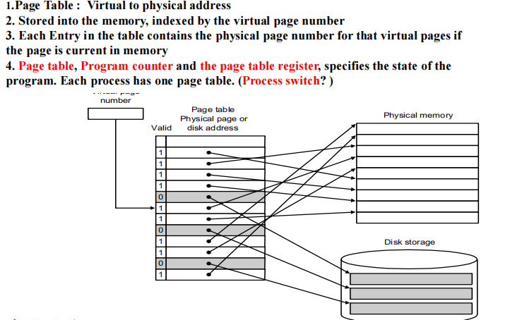

# Exploiting Memory Hierarchy

## Memory Technologies

回顾计逻的知识:

- SRAM(static random access memory)
    - 数据被存在反向器上
    - very fast but takes up more space than DRAM
- DRAM
    - value is stored as a charge on capacitor(must be refreshed)
    - very small but slower than SRAM
- Flash Storage (Nonvolatile semiconductor storage)
- Disk Storage

## Memory Hierarchy Introduction

- **Temporal locality**: Items accessed recently are likely to be accessed agian soon.(instructions in a loop, induction variables)
- **Spatial locality**: Items near those accessed recently are likely to be accessed soon.(sequential instruction access, array data)

### Taking Advantage of Locality

- Store everything on disk
- Copy recently accessed (and nearby) items from disk to smaller DRAM memory (Main memory)
- Copy more recently accessed (and nearby) items from DRAM to smaller SRAM memory (Cache memory attached to CPU, 其实 cache 是在 CPU 内部的)

容量不断变小，速度不断变快，单位成本越来越高。

- Block: 从底下一级存储器往上一级存储器搬数据的最小单位。
- Hit: 如果我访问的数据在上一级存储器中，则称为命中。
    - Hit ratio: hits/accesses
    - Hit time: the time to access the upper level of the memory hierachy, which includes the time needed to determine whether the access is a hit or a miss.
- Miss: accessed data is absent.
    - Time taken: miss penalty (如果 miss 了，就需要从 Lower level 搬一个 block 上来，所需的时间就是 miss penalty,需要注意的是，如果 upper level 满了，还需要替换掉一个 block)
    - Miss ratio: misses/accesses = 1 - hit ratio

接下来讨论两个概念：

- The basics of Cache: SRAM and DRAM, 解决速度的问题
- Vitural Memory: DRAM and DISK, 解决容量的问题

## The basics of Cache

对于内存中的每个位置，cahce 里有唯一的位置分配，这意味着 lots of items at the lower level share locations in the upper level.

因此我们要解决两个问题：

- How do we know if a data item is in the cache?
- If it is, how do we find it?

### Direct Mapped Cache

将内存地址对 cache 中的 block 数取模，得到对应 cache 中的位置。

我们首先要知道 cache 中某一块是否为空，因此设置一个 valid bit， 0 代表空。
我们要怎么知道 cache 中某一块是内存中的哪个 block？

- Store block address as well as the data(onlu need the high-order bits), called the tag.

由于取模的特性，内存地址的低位信息已经由 cache 中的 Block location 表示，因此我们存储 data 时只需要存地址的高位信息即可。

内存中的地址都是以字节为单位的，而 block address 都是以 block 为单位的。由于一个 block 总是 2 的若干次方个 word 那么大， 而每个 word 是 4 Byte，因此每个 block 的 byte 数也是 2 的若干次方。因此，我们只需要去掉 byte address 的后几位，就可以获得它的 block address 了。这样相邻的 2 的若干次方个 byte 就会聚合成一个 block 了，因为它们的 byte address 的前若干位，即 block address，是相同的。

因此，我们将 byte address 分为 2 个部分：block address 和 byte offset，即所在 block 的编号以及在 block 中的偏移量 (in byte)；而 block address 又分为了两个部分，即 tag 和 index。

### Handling Cache reads hit and miss

- Read hits: 正是我们想要的！
- Read misses:
    - 一种是指令的 miss
    - 一种是数据的 miss

对于指令 miss, 我们首先 stall CPU，再从内存中取出对应的 block 放到 cache 里之后，重启 CPU。

1. Send the original PC value (current PC - 4) to the memory.
2. Instruct main memory to perform a read and wait for the memory to complete its access.
3. Write the cache entry, putting the data from memory n the data portion of the entry, writing the upper bits of the address into the tag field, and turing the valid bit on.
4. Restart instruction execution at the first step, which will refetch the instruction again, this time finding it in the cache.

## Deep concept in Cache

Four Questions for Memory Hierarchy Designers

- Where can a block be placed in the upper level? (Block placement)
    - Fully Associative, Set Associative, Direct Mapped
- How is a block found if it is in the upper level? (Block identification)
    - Tag/Block
- Which block should be replaced on a miss? (Block replacement)
    - Random, LRU, FIFO
- What happens on a write? (Write Strategy)
    - Write Back or Write Through(with Write Buffer)

### Block placement

- Directed mapped: Block 只能去唯一的地方(Block address MOD Number of blocks in cache)
- Fully associative(全关联): Block can go anywhere in cache.
- Set associative: (介于上述两种方法之间)
    - Block can go in one of a set of places in the cache.
    - A set is a group of blocks in the cache (Block address MOD number of sets in the cache)
    - If sets have n blocks, the cache is said to be n-way set associative.

!!! Example

    

### Block Identification

与前文一样的方法： tag 和 valid bit，只是根据 Placement 方法的不同略有差异。

#### The format of the Physical Address

- The index field selects:
    - The set, in case of a set-associative cache
    - The block, in case of a direct-mapped cache
    - Has as many bits as $\log_2(#sets)$ for set-associative caches, or $\log_2(#blocks)$ for direct-mapped caches.
    - 对于全关联，不需要 index。
- The **byte offset** field selects:
    - The byte within the block
    - Has as many bits as $\log_2$(size of block)
    - 对于为什么要使用 byte offset,我们需要清楚寻找到的地址是以 block 为单位的，而具体到 Block 里的哪个 word 则需要 byte offset 来访问。
- The tag is used to find the matching block within a set or in the cache
    - Has as many bits as **Address_size-Index_size-Byte_Offset_size**

### Block Replacement

- In a direct-mapped cache, there is only one block that can be replaced.
- In set-associative and fully-associative cachesm there are $N$ blocks (where $N$ is the degree of associativity)

**Different strategy**

- Random replacement
    - Easy to implement in hardware, just requires a random number generator.
    - Spreads allocation uniformly across cache.
    - May evict a block that is about ti accessed.
- Least-Recently used(LRU): pick the block in the set which was least recently accessed
    - Assumed more recently accessed blocks more likely to be referenced again.
    - This requires **extra bits** in the cache to keep track of accesses.
- First in first out(FIFO): choose a block from the set which was first came into the cache.

### Write Strategy

When data is written into the cache, is the data also written to main memory?

- Wrtie-through cache: written to memory
    - Can always discard cached data - most up-to-date data is in memory
    - Cache control bit: only a valid bit
    - memory (or other processors) always have latest data
- write-back cache: not written to memory
    - Can’t just discard cached data - may have to write it back to memory
    - Cache control bits: both valid and dirty bits
    - much lower bandwidth, since data often overwritten multiple times

#### Wirte Stall

CPU must wait for writes to complete during write through.

**Write buffers**

- A small cache that can hold a few vales waiting to go to main memory.(小的缓存，避免 write stall)
- It does not entirely eliminate stalls since it is possible for the buffer to fill if the burst is larger than the buffer.

## Measuring and improving cache performance

- Reducing cache misses by more flexible placement of blcok
- Reducing the miss penalty using multilevel caches

Average Memory Access time = hit time + miss time

### Measuring cache performance

## Vitual Memory

Main memory can act as a cache for the secondary storage(disk).

对于每个程序，我们希望它们只考虑自己的内存空间，并且认为它们的内存是连续的。虚拟内存的作用就是将程序连续的内存地址翻译成实际上碎片化的物理地址。

Advantages:

- Illusion of having more physical memory
- program relocation
- protection

### Pages: virtual memory blocks

虚拟内存映射的最小单位是 Page。

- 操作系统完全管理这个映射关系。
- 我们采用 write-back 策略，因此需要一个额外的 dirty bit 位。The dirty bit is set when a page is first written.If the dirty bit of a page is set, the page must be written back to disk before being replaced.

### Page Tables

维护一张表，记录某个 virtual page number 转化到的实际 physical page number 是多少。

由于每个程序都是连续的，自己的 pc 都是从零开始的，因此每个程序都拥有自己的 page table。并且使用全关联映射的方法。

### Making Address Translation Fast: TLB

TLB 是专用的高速查找硬件 cache，这里称它为 translation look-aside buffer (TLB)。它实际上就是 page table 的专用 cache，其 associativity 的设计可以根据实际情况决定。

