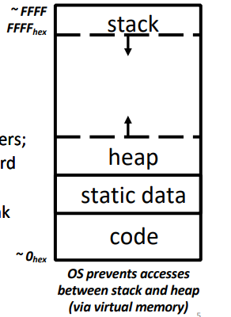
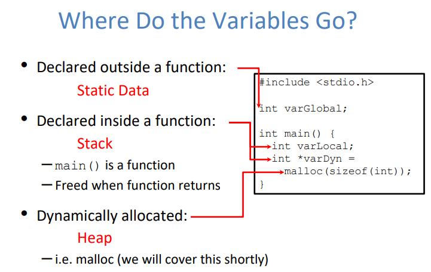

# C Memory Managment

## Memory Location

A program's address space contains 4 regions:

- Stack: local variables inside functions, grows downward.
- Heap: space requested via malloc(); resize dynamically, grows upward.
- Data(Static Data): variables declared outside main, does not grow or shrink.
- Text(code): program executable loaded when program starts, does not change.

!!! note

    OS prevents accesses between stack and heap(via virtual memory) to avoid stack grows into heap and likewise.

!!! Example "What do the variables go?"

    

## The Stack

- Each stack frame is a contiguous block of memory holding the local variables of a single procedure.
- A stcak frame includes:
    - Location of caller function
    - Function arguments
    - Space for local variables
- Stack pointer tells where lowest(current) stack frame is.
- When procedure ends, stack pointer is moved back(but data remains (garbage!)); frees memory for future stack frames.

## Static Data

## Code