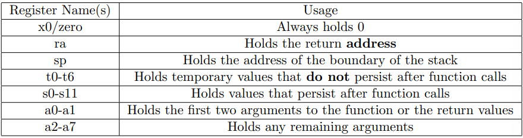

# Understanding RISC-V Convention

## RISC-V Convention

### Registers

- In RISC-V each of the 32 registers has a different name which indicates its intended usage.



1. `ra` holds the return address. In particulat it is useful for function calls:

!!! Example "understand `ra`"

    ```
    def foo():
        x = 1
        bar()
        z = 2
    def bar():
        y = 7
    ```

   Imagine we are at the line `y = 7` in bar. When bar finishes we want to resume execution inside of `foo` and complete the next instruction, `z = 2`. We do this by storing the address of the instruction where the code should return. In this case `ra` would hold the address of `z = 2` so execution resumes as expected after a function call.

2. `sp` holds the current base of the stack. When we need to add more space onto the stack, we will decrement `sp` which gives us more addresses at which to store data. When we exit a function we will increment `sp` to restore the stack back to the state when entering the function.
3. `t` register values are not guaranteed to exist after calling a function, while `s` registers should be used for values needed after a function call.

### Function Calls

We make a function call using `jal` instruction to a label or a `jalr` instruction to a register rd. 

In particular, `jal ra label` or `jalr ra rd imm` but sometimes we will abbreviate it with the pseudo-instruction `jal label` or `jalr rd`. What this `jal` does is store `PC+4` in `ra`, which is the address of the next instruction to run after the function all and increment the PC by the offset to the label. `jalr` is similar except it sets the PC value to `rd+imm`.

Jumping to a label withou making a function call is done with the instructions `jal x0 label` and `jalr x0 rd imm`, sometimes abbreviated with the pesudo-instructions `j label` and `jr rd`. 


### Prologue/Epilogue

- The `sp` will have the same value when exiting the function that it did entering(unless we store retun values on the stack).
- All `s` registers will have the same value exiting the function that they did entering.
- The function will return to the value stored in `ra`, assuming no abnormal execution.

**To achieve this we add a section before our function called the prologue and a section afer called the epilogue**:

```
def prologue():
    decrement sp by num s registers + local var space
    Store any saved registers used
    Store ra if a function call is made

def epilogue():
    Reload any saved registers used
    Reload ra (if necessary)
    Increment sp back to previous value
    Jump back to retun address
```


