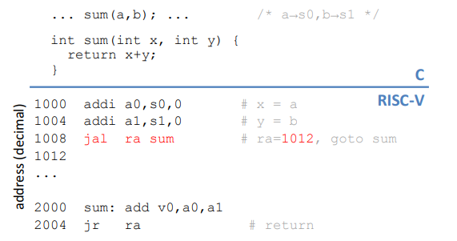
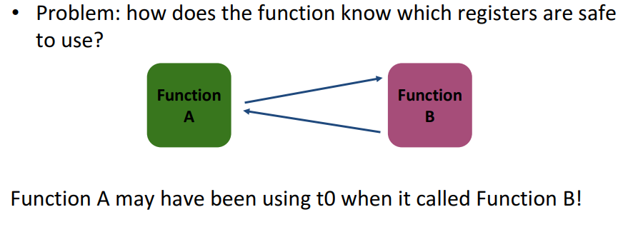
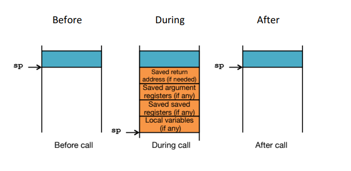
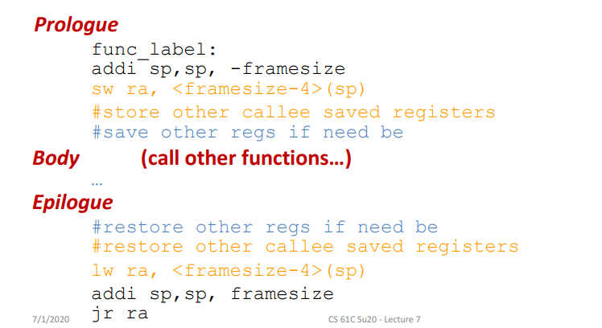
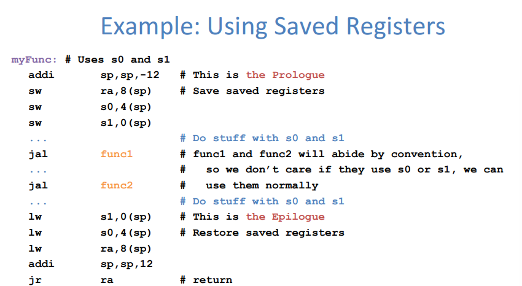
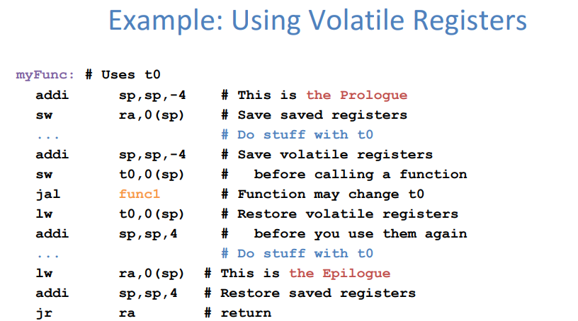

# Introduction to Machine Language: RISC-V

## Registers

- Unlike C, assembly doesn't have variables.
- Instead, assembly uses registers to store values.
- Registers are:
    - Small memories of a fixed size
    - Can be read or written
    - Limited in number(32 registers)
    - Very fast and low power to access

***What if more variables than registers?***

- Keep most frequently used in registers and move the rest to memory(called **spilling to memory**)

***Why are not all variables in memory?***

- Smaller is faster: registers 100-500 times faster

!!! note Tradeoff between speed and availablity

    - more registers: can house more variables
    - smultaneously, all registers are slower

    RISCV has 32 registers(x0-x31)
    Each register is 32 bits wide and holds a word
    (a word is a fixed-sized piece of data handled as a unit by the instruction set or hardware of the processor. Normally a word is defined as the size of a CPU's registers.)

**The Zero Register**

- Zero appears so often in code ans is so useful that it has its own register.
- Register zero(x0) always has the value 0 and cannot be changed.(any instruction writing to x0 has no effect).

## Assembly Code

- One operation per instruction, at most one instruction per line.

### Basic Arithmetic Instructions

### Immediate Instructions

- Numerical constants are called immediates

### Data Transfer Insrtuctions

!!! note "Memort is Byte-Addressed"

    What is the smallest data type in C?

    - A char, which is a byte(8 bit)
    - Everything in multiples of 8 bits

    Memory addresses are indexed by bytes, not words. 
    Word addresses are 4 bytes apart, word addr is same as first byte, addrs must be multiples of 4 to by word-aligned.

### Control Flow Instructions

- Outcomes of comparative/logical statements determined which blocks of code to execute
- In RISCV, we can't define blocks of code, all we have are labels.
    - Defined by text followed by a colon(e.g. `main:`) and refers to the istruction that follows
    - General control flow by jumping to labels

**Program Counter**

- Branches and Jumps change the flow of execution by modifying the PC
- The PC is a special register that contains the current address of the code that it being executed

### Shifting Instructions

- Logical shift: add zeros as you shift
- Arithmetic shift: Sign-extend as you shift(Only applies when shifting right)

## Functions in Assembly

### Six Steps of Calling a Function

1. Put arguments in a place where the function can access them.
2. Transfer control to the function.
3. The function will acquire any (local) storage resources it needs.
4. The function performs its desired task.
5. The function puts return value in an accessible place and "cleans up".
6. Control is returned to you.

**Where should we put the arguments and return values?**

- Use Registers
- `a0-a7`: eight argument registers to pass parameters.
- `a0-a1`: two argument registers also used to return values.
- If need extra soace, use memory(the stack).

- `sp`: stack pointer, holds the current memory address of the bottom of the stack.

**How do we Transfer Control?**

- Jump(`j`): `j label`
- Jump and Link(`jal`): `jal dst label`
    - Address of following instruction put in `dst`
    - Jumps to target address
- Jump and Link Register(`jalr`): `jalr dst src imm`
- Jump Register(`jr`): `jr src`
- `ra`: return address register, used to save where a function is called from so we can get back.

**Link**: saves the location of instruction in a register before jumping

??? Example "Function Call Example"

    

### Function Calling Conventions

- Caller: the calling function
- Callee: the function being called

#### Saved Registers(Callee Saved)

- These registers are expected to be the same before and after a function call
    - If callee uses them, it must restore values before returning
    - This means save the old values, ues the registers, then reload the old values back into the registers
- `s0-s11`(saved registers)
- `sp`(stack pointer): If not in same place, the caller won't be able to properly access its own stack variables

#### Volatile Registers(Caller Saved)

- These registers can be freeely changed by the callee
    - If caller needs them, it must save those values before making a procedure call
- `t0-t6`(temporary registers)
- `a0-a7`(return address and arguments)
- `ra`(return address)

We use stack to save registers:

**Basic Sturcture of a Function**

!!! Example 

    

    

## RISC-V Instruction Formats

### Stored-Program Concept

Instructions can be represeted as bit patterns

- Entire programs stored in memory just like data
- Reprogramming just takes rewriting memory rather than rewiring computer

- Since instructions and data are both in memory, addresses can point to either
- The Program Counter(PC) just holds a memory address that points to code

- Whether a number is code or a value is all in how you interpret it

- Define 6 types of instruction formats

### R-Format

