# Introduction to Machine Language: RISC-V

## Registers

- Unlike C, assembly doesn't have variables.
- Instead, assembly uses registers to store values.
- Registers are:
    - Small memories of a fixed size
    - Can be read or written
    - Limited in number(32 registers)
    - Very fast and low power to access

***What if more variables than registers?***
- Keep most frequently used in registers and move the rest to memory(called **spilling to memory**)

***Why are not all variables in memory?***
- Smaller is faster: registers 100-500 times faster

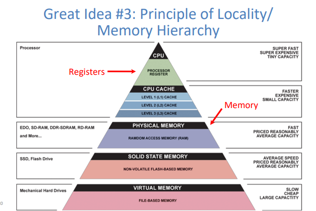

!!! note Tradeoff between speed and availablity

    - more registers: can house more variables
    - smultaneously, all registers are slower

    RISCV has 32 registers(x0-x31)
    Each register is 32 bits wide and holds a word
    (a word is a fixed-sized piece of data handled as a unit by the instruction set or hardware of the processor. Normally a word is defined as the size of a CPU's registers.)

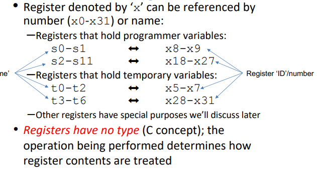

**The Zero Register**
- Zero appears so often in code ans is so useful that it has its own register.
- Register zero(x0) always has the value 0 and cannot be changed.(any instruction writing to x0 has no effect).

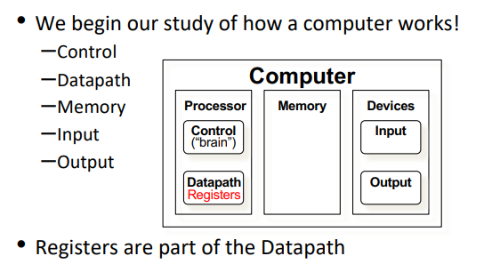

## Assembly Code

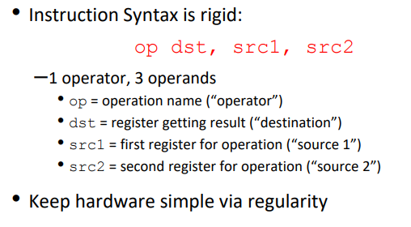

- One operation per instruction, at most one instruction per line.

### Basic Arithmetic Instructions

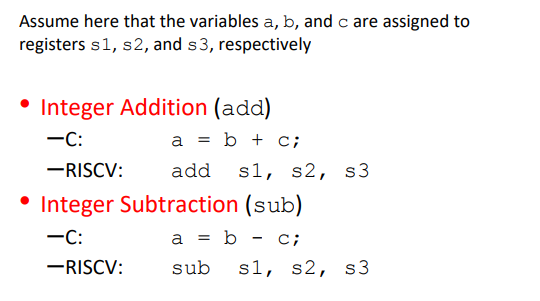

### Immediate Instructions

- Numerical constants are called immediates

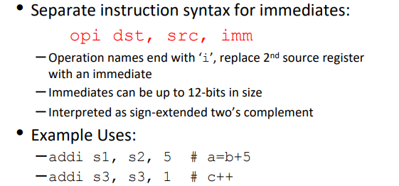

### Data Transfer Insrtuctions

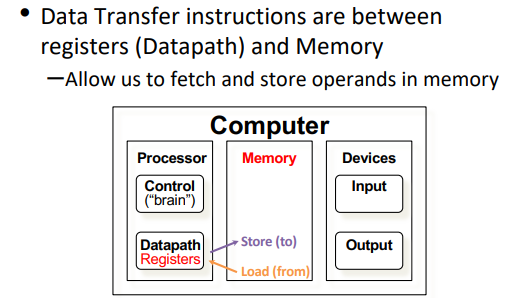

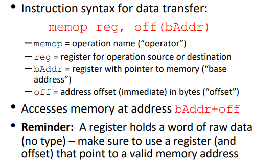

!!! note "Memort is Byte-Addressed"

    What is the smallest data type in C?
    - A char, which is a byte(8 bit)
    - Everything in multiples of 8 bits

    Memory addresses are indexed by bytes, not words. 
    Word addresses are 4 bytes apart, word addr is same as first byte, addrs must be multiples of 4 to by word-aligned.

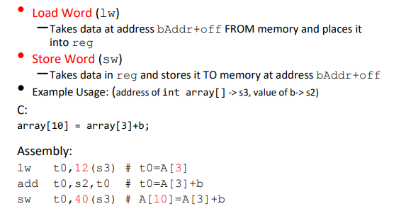

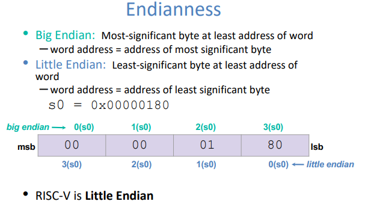

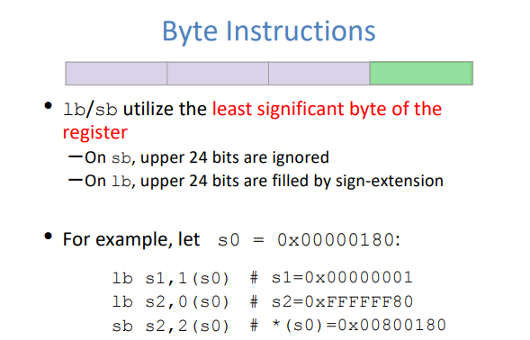

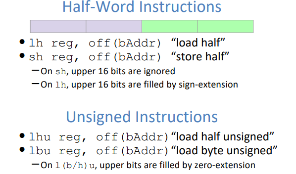

### Control Flow Instructions

- Outcomes of comparative/logical statements determined which blocks of code to execute
- In RISCV, we can't define blocks of code, all we have are labels.
    - Defined by text followed by a colon(e.g. `main:`) and refers to the istruction that follows
    - General control flow by jumping to labels

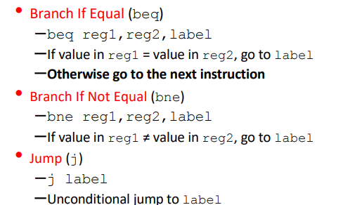

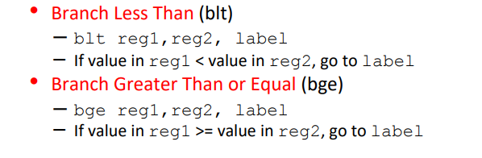

**Program Counter**

- Branches and Jumps change the flow of execution by modifying the PC
- The PC is a special register that contains the current address of the code that it being executed

### Shifting Instructions

- Logical shift: add zeros as you shift
- Arithmetic shift: Sign-extend as you shift(Only applies when shifting right)

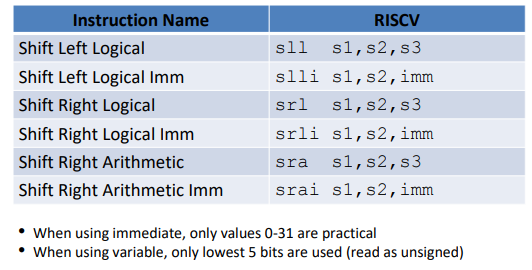

