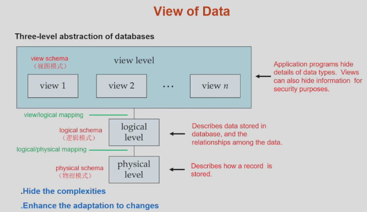
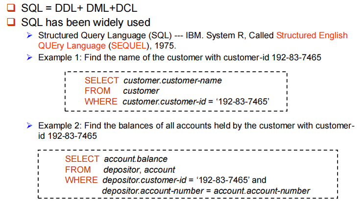
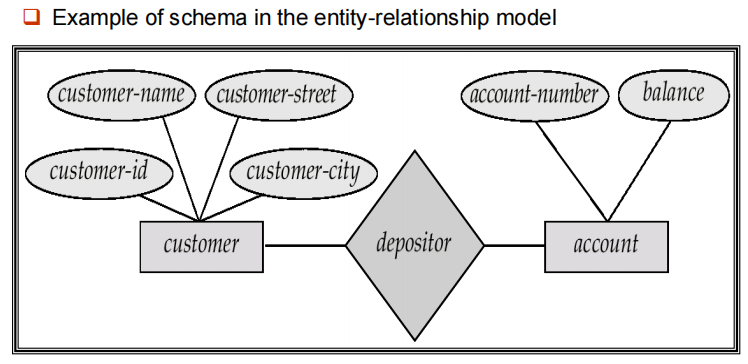
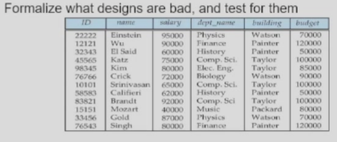
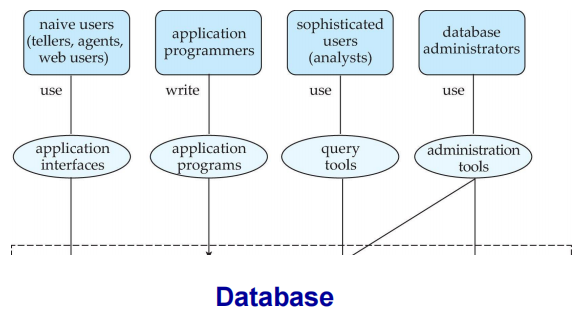
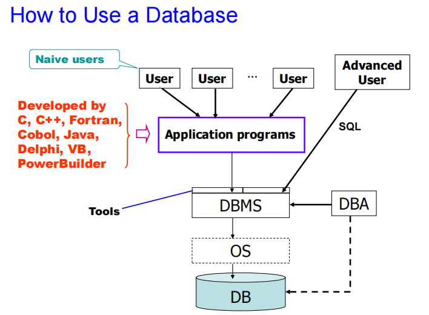
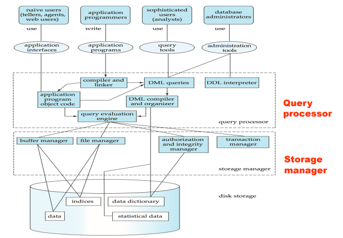

# Introduction

## Database Systems

**数据库管理系统(DBMS)**由一个互相关联的数据的集合和一组用以访问这些数据的程序组成。

- 这个数据集合称作数据库，其中包含了关于某个企业的信息。
- DBMS主要目标是提供一种可以方便、高效地存取数据库信息的途径。

> 设计数据库系统的目的是为了管理大量信息。对数据的管理既涉及信息存储结构的定义，又涉及信息操作机制的提供。此外数据库系统还必须提供所存储信息的安全性保证，即使在系统崩溃或有人企图越权访问时也应保障信息安全性。如果数据被多用户共享，系统还必须设法避免可能产生的异常结果。

## Purpose of Database Systems

### 文件处理系统的弊端

- 数据的冗余与不一致。不同文件可能有不同结构，不同程序可能采用不同语言，相同信息可能在几个地方重复存储。
- 存取数据困难。若原始系统没有现有的程序来满足新的需求，则需要编写新的程序。
- 数据孤立。数据分散在不同的文件中，不同文件有不同的格式。
- 完整性问题。数据库中所存储数据的值必须满足某些特定的一致性约束(example:性别只能有男、女)。很难加入新的约束或改变现有的约束。
- 原子性问题：举个例子，比如说转账的操作，A转账100元给B，需要A的余额减100，B的余额加100，这个过程必须要么同时发生要么不发生(原子的)。如果这个过程中计算机系统发生故障，比如说掉电，那么有可能A的余额减去的100元还没来得及存入B的余额中，造成数据库状态的不一致。
- 并发访问异常。许多系统允许多个用户同时更新数据。
- 安全性问题。(Authentication)认证、(Priviledge)权限、(Audit)审计。

### Characteristics of Databases

- data persistence
- convenience in accessing data
- data integrity
- concurrency conctrol for multiple users
- failure recovery
- security control

## View of Data

### Data Abstraction

数据库系统的一个主要目的是给用户提供数据的抽象视图，系统隐藏关于数据存储和维护的某些细节。

- physical level: 描述数据实际上是怎样存储的。
- logical level: 描述数据库中存储什么数据，这些数据间存在什么关系。
- view level： 不同人看到他们需要的那部分信息。

**优点**
  
- 隐藏复杂性： 开发不同层的人只需要该层的数据，不需要关注其它层。
- 增强适应变化能力
    - 物理环境变化，通过调整逻辑关系和映射来适应新的物理环境。
    - 逻辑环境变化（业务环境变化），通过view和logic的映射使得view尽量少变化。

### Schema and Instance

Instance(实例)：特定时刻存储在数据库中的信息的集合。
Schema(模式)：数据库的总体设计。

### Data Independence

- Physical data independence: the ability to modify the physical schema without changing the logical schema.
- Logic data independence:  protect application programs from changes in logical structure of data.

### Data Models

数据模型是一个描述数据、数据联系、数据语义以及一致性约束的概念工具的集合。

- 关系模型(Relational Model)：表格(列/属性、行/元组)
- 实体-联系模型(Entity-Relationship Model)：现实世界由一组称作实体的基本对象以及这些对象间的联系构成。
- 基于对象的数据模型(Object-based data model)：支持面向对象的特征
- 半结构化数据模型(semistructured data model): 文本和图像是非结构化数据，不利于计算机处理。一篇论文可以视为半结构化数据，整体有结构，但具体是非结构化的，用可扩展标记语言(XML)表示。
- 其它模型： 网状数据模型、层次数据模型

## Database Language

### Data Definition Language(DDL)

数据库系统所使用的存储结构和访问方式是通过一系列特殊的DDL语句说明。

!!! note

    C语言的struct经过编译后变为了01二进制代码，但数据库中这些定义作为数据存放着(metadata 元数据，data about data)。

    - Database schema
    - integrity constraints(完整性约束)
        - Primary key(ID uniquely identifies instructors)
        - Referential integrity(参照完整性)
    - Authorization：不同用户在数据库中不同数据值上允许不同的访问类型。

### Data Manipulation Language(DML)

两类基本的数据操作语言：

- 过程化DML(procedural DML)： 可以用来编写算法的(顺序、循环、分支)。
- 陈述式DML(declarative): 只要求用户指定需要什么数据，而不指明如何获得这些数据。

DML also known as **query language**.

### Database Access from Application Program

SQL语言通过高级语言(a host language宿主语言)来调用。

通过如下两种方式：

- API(ODBC/JDBC) which allow SQL queries to be sent to a database.
- Language extensions to allow **embedded SQL**.通过预处理器，将select语句识别出来，翻译成C语言的函数调用。

## Database Design

- Entity Relationship Model(实体-联系模型)

上图表示有 customer 和 account 两个实体集，它们具有一些属性。并指明了它们之间的depositor联系。

映射基数(mapping cardinality): 一对一/一对多/多对一/多对多

- Normalization Theory(规范化理论)

这个表存在冗余，departement重复，应该拆分为两个表(前四列、后三列)。

## Database Users and Administrators

根据所期望的与系统交互方式的不同，将数据库系统的用户分类：

- Naive user: 通过激活事先已经写好的应用程序同系统进行交互。
- Application programmer: interact with system via SQL calls.编写应用程序的计算机专业人员。
- sophisiticated user: form requests in a database query language 数据分析师
- specialized users: 编写专门的、不适合于传统数据处理框架的数据库应用的富有经验的用户。

**Database Administrator**

DBA: A special user having central control over database and programs accessing those data.
DBA拥有最高权限。
DBA的作用：

- 模式定义：用DDL创建最初的数据库模式
- 存储结构及存取方法定义
- 模式及物理组织的修改
- 数据访问授权
- 日常维护

## Transaction Management

Transaction requirements include atomicity, consistence, isolation, durability.

## Database Architecture

