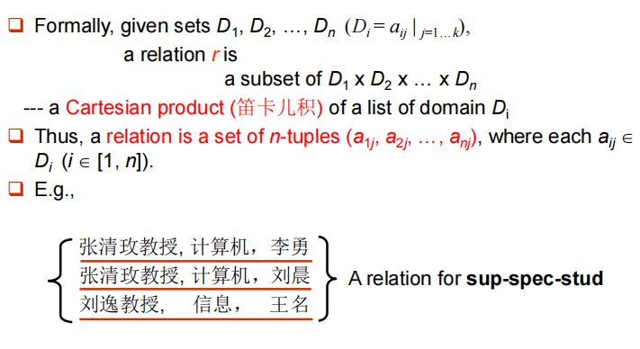
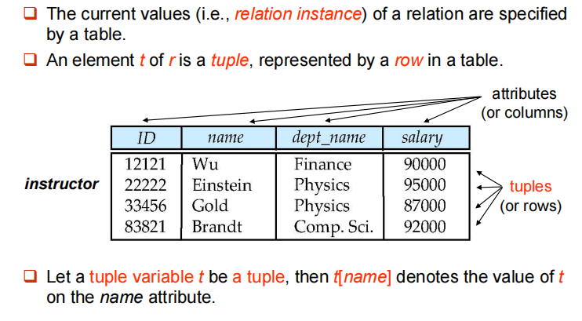
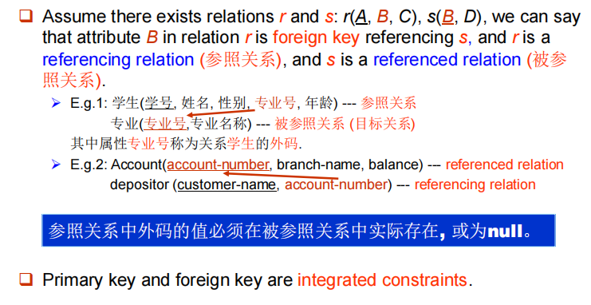
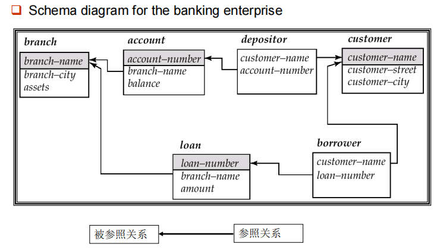

# 关系模型

## Structure of Relational Databases

### Basic Structure

关系用来指代表，元组用来指代行，属性用来指代列。

### Attribute Types

- Each attribute of a relation has a name.
- The set of allowed values for each attribute is called the **domain** of the attribute.
- Attribute values are required to be atomic, i.e., indivisible
    - multivalued attribute values are not atomic.(多值属性，例如手机号，一个人可能有多个手机号)
    - composite attribute values are not atomic.(组合属性，例如地址)
- The special value **null** is a member of every domain

### Concepts about Relaion

- concerned with two concepts: relation schema and relation instance

- The relation schema describes the structure of the domain.
- The relation instance corresponds to the snapshot of the data in the relation at a given instant in time.

!!! note "类比"

    关系模式的概念对应于程序设计语言中类型定义的概念。
    关系实例则对应于变量的值。给定变量的值可能随时间发生变化，当关系被更新时，关系实例的内容也随时间发生了变化。相反，关系模式一般不发生变化。

### Relation Schema

Assume $A_1,A_2,\cdots A_n$ are attributes,
Formally expressed:
$$
R=(A_1,A_2,\cdots A_n)
$$
is a relation schema.

Eg: *instructor=(ID,name,dept_name,salary)*

$r(R)$ is a relation on the relation schema $R$.

### Relation Instance

### The Properties of Relation

- The order of tuples is irrelevant
- No duplicated tuples in a relation
- Attribute values are atomic

### Key

- Let $K\subset R$
- $K$ is a superkey(超码) of $R$ if values for $K$ are sufficent to identify a unique tuple of each possible relation $r(R)$.
- $K$ is a candidate key(候选码) if $K$ is minimal superkey.
- $K$ is primary key(主码) if $K$ is a candidate key and is defined by user explicitly.(usually marked by underline)

**Foreign Key**

### Schema Diagram

## Relational-Algebra Operations

