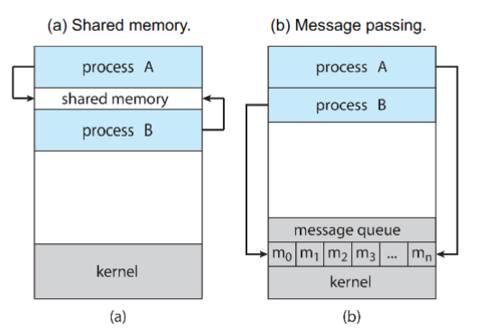
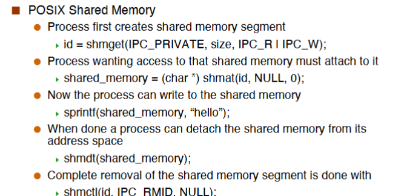

# Inter-Process Communications

- Processes within a host may be independent or cooperating.
- Reasons for cooperating processes:
    - Information sharing
    - Computation speedup
    - Modularity
    - Convenience
- Means of communication for cooperating processes is called Inter-Process Communication

## IPC Communication Models

Process is designed for isolation, so IPC is not easy!!

- Message-passing
    - useful for exchanding small amounts of data
    - simple to implement in the OS
    - somtimes cumbersome for the user as code is sprinkled with send/recv operations
    - high-overhead: one syscall per communication operation
- Shared Memory
    - low-overhead: a few syscalls initially, and then none.
    - more difficult to implement in the OS.

### Shared Memory

- Processes need to establish a shared memory region
    - One process creates a shared memory segement
    - Processes can then attach it to their address spaces. (**Note that this is really contrary to the memory protection idea central to multi-programming!**)

存在的问题就是不安全，我们可以拿到 `share_id`, 就可以把共享内存 attach 到自己的进程上，可以观察到其它进程的数据。

We are breaking one of the fundamental abstractions provided by the OS: memory isolation.

Sharing memory among multiple running contet is done using **threads**.

### Message Passing

- Two fundamental operations
    - send: to send a message
    - recv: to receive a message
- If processes P and Q wish to communicate they
    - establish a communication link between them
    - place calls to sned() and recv()
    - optionally shutdown the communication link
- Message passing is key for distributed computing.

#### Implementing Message-Passing

- Implementation of commmunication link
    - Physical: shared memory, hardware bus, network
    - Logical: Direct or indirect, synchronous or asynchronous, automatic or explicit buffering
- Direct Communication
    - Processes must name each other explicitly.
    - link 太多了
- Indirect Communication
    - Messages are directed and received from mailboxes(also referred to as ports)

#### Synchronization

