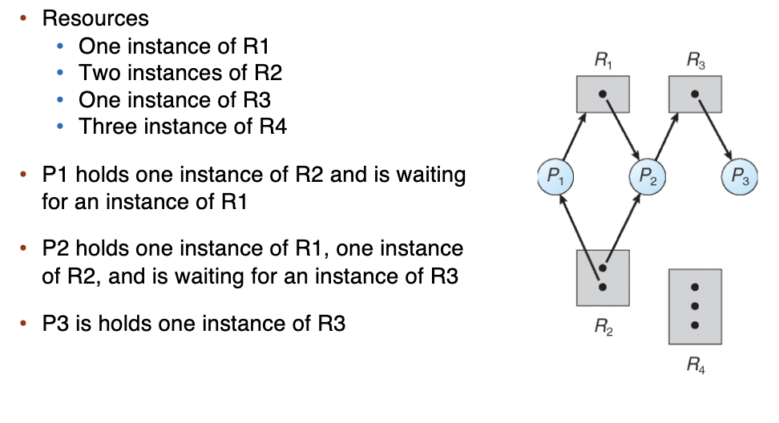
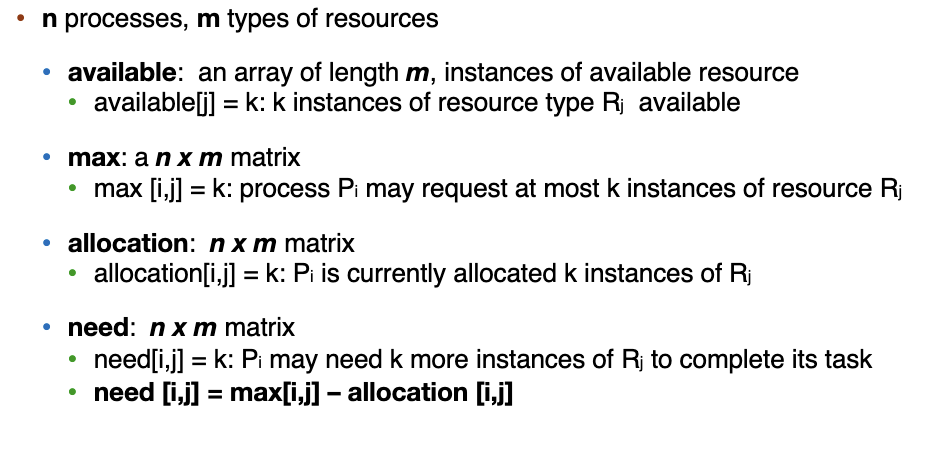
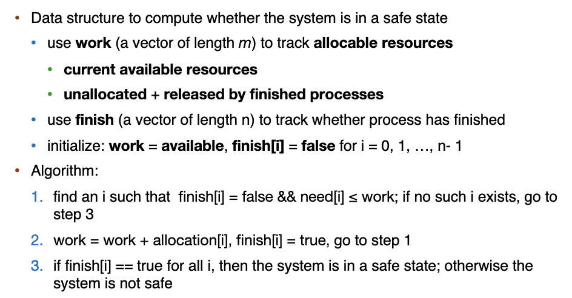
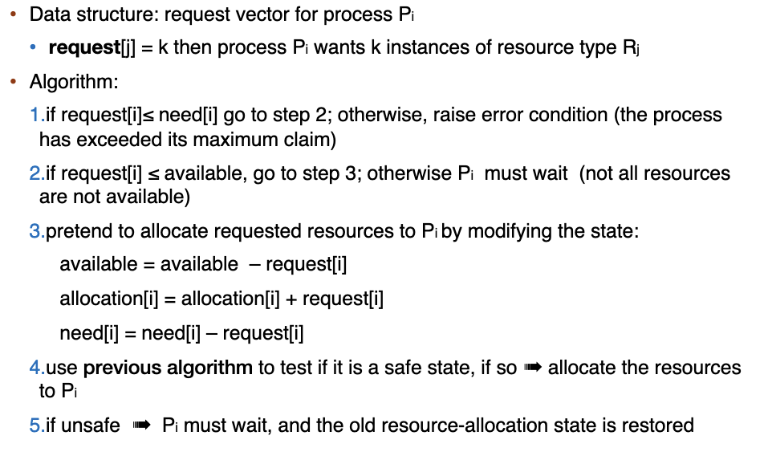

# Deadlocks

A deadlock is a situation in which every process in a set of processes is waiting for an event thatt can be caused only be another process in the set. (存在一个线程/进程的集合，它们互相等待对方持有的资源)

!!! note

    most OSes do not prevent or deal with deadlocks.

## System Model of Deadlock

- Resources: R1, R2, $\cdots$, R_m
    - each represents a different resource type. (CPU cycles, memory space, I/O devices)
    - each resource type $R_i$ has $W_i$ instances.

### Four Conditions of Deadlock

- 互斥(mutual exclusion): 死锁中的资源必须是非共享的，一次只能被一个进程/线程使用。
- 持有并等待：死锁中的线程在等待资源的同时，也必须持有至少一个资源。
- 非抢占：死锁中的进程/线程只能在使用完资源后主动释放资源，其持有的资源无法被其它进程抢占（为了保证等待关系不会被强行破坏）
- 循环等待：死锁中的进程存在环状的等待资源关系。$\{P_0,\cdots, P_n\}$

### Resource-Allocation Graph

Two types of nodes:

- $P=\{P_1,\cdots,P_n\}$, the set of all the processes in the system.
- $R=\{R_1,R_2,\cdots,R_m\}$, the set of all resource types in the system.

Two types of edges:

- request edge: directed edge $P_i->R_j$
- assignment edge: directed edge $R_i->P_i$

- If graph contains no cycles -> no deadlock
- If graph contains a cycle
    - if only one instance per resource type -> deadlock
    - if several instances per resource type -> possibility

## How to Handle Deadlocks

- Ensure that the system will never enter a deadlock state
    - Prevention
    - Avoidance
- Allow the system to enter a deadlock state and the recover
    - Deadlock detection and recovery
- Ignore the problem and pretend deadlocks never occur in the system.

### Deadlock Prevention

核心思路是破坏死锁产生的必要条件。由于要让死锁出现，上述四个条件必须同时满足，所以我们只要保证其中有一个条件始终不成立。

- 破坏 mutual exclusion
    - 几乎无法破坏，很多资源天然互斥
    - sharable 的可以，non-sharable 的没办法
- 破坏 hold & wait
    -  我们可以让一个进程/线程一旦申请资源就一次性获取所有资源，如果没办法获取所有资源就释放已经申请到的资源，通过这种方法可以避免循环等待的产生。
    -  low resource utilization, starvation possible
- 破坏 no preemption
    - 通过允许进程/线程强行抢占另外一个进程/线程持有的资源，可以破坏被动的等待关系，从而避免死锁。
    - 但是强行抢占一部分资源可能导致进行到一半的任务失败，甚至一些更严重的后果。
- 破坏 circular wait
    - 给锁一个优先级排序，取锁的时候要求从高往低处取锁。
    - require that each process requests resources in an increasing order
    - many operating systems adpot this strategy for some locks.

### Deadlock Avoidance

在分配资源之前，先判断是否会死锁，如果会死锁就不分配。

**Safe State**

- safe state 指存在 safe sequence 的状态，系统按照 safe sequence 的顺序执行进程/线程和资源分配，就不会出现死锁。
- safe sequence 中的每一项 $T_i$ 所需要的资源，都能通过现有资源或其之前的进程/线程 $T_j, j<i$ 执行完毕释放的资源来满足。
    - 对于 safe sequence $<T_1,T_2,\cdots, T_n>$ 我们定义每一项还需要的 $R_j$ 资源为 $\text{need}_{i,j}$, 已经被分配到 $R_j$ 资源为 $\text{allocated}_{i,j}$, 以及资源 $R_j$ 中还空闲的资源的量 $\text{available}_{j}$，则我们应该有：
    - $\text{available}_j+\sum_{k=1}^{i-1}\text{allocated}_{k,j}\ge \text{need}_{i,j}$.

**Deadlock Avoidance Algorithms**

- Single instance of each resource type: use resource-allocation graph
- Multiple instances of a resource type: use the banker's algorithm

#### Single-instance Deadlock Avoidance

直接检测某种分配是否会导致死锁发生，如果该分配会导致死锁发生，则不进行分配。

Resource-allocation graph can be used for single instance resource deadlock avoidance.

- one new type of edge: claim edge
    - claim edge $P_i->R_j$ indicates that proess Pi **may** request resource Rj (未来申请)
    - claim edge is represented by a dashed line
    - resources must be claimed a priori in the system.(要事先声明)

按如下规则反映分配过程：

- 进程/线程 $T_i$ 被添加到资源分配图的时候，需要连好所有相关的 claim edge(要求最初知道所有的资源，这也构成这类方法的一个局限)
- 进程/线程 $T_i$ 获得申请 $R_j$ 的时候，如果这条边变为 assignment edge 不会导致成环，则将 claim edge 转化为一条 request edge.
- 进程/线程 $T_i$ 获得资源 $R_j$ 的时候，将 request edge 转化为一条 asssignment edge.
- 进程/线程 $T_i$ 释放资源 $R_j$ 时，将 assignment edge 删除。

- Suppose that process $P_i$ requests a resource $R_j$
- The request can be granted only if:
    - converting the request edge to an assignment edge does not result in the formation cycel
    - no cycle -> safe cycle.

#### Banker's Algorithm

我们通过 available (当前还没有被分配的空闲资源)， max(进程所需要的资源)，allocation(已经分配的资源),need (还需要分配多少资源) 这四个矩阵来刻画一个时间内各个进程对各种资源的持有和需求情况。

**Safe State**

**Resource Allocation**

### Deadlock Detection

- 单实例资源：动态维护这个 wait-for graph ，并且定期调用一个环检测算法。
- 多实例资源：类似银行家算法，如果找不到任何安全序列，则说明系统处于死锁状态。

### Deadlock Recovery

- Option 1
    - terminate deadlocked processes options
        - abort all deadlocked processes
        - abort one process at a time until the deadlock cycle is eliminated.
        - in which order should we choose to abort?
            - priority of process
            - how long process has computed, and how much longer to completion
            - resources the process has used
            - resources process needs to complete
            - how many processes will need to be terminated
            - is process interactive or batch?
- Option 2
    - Resource preemption
        - select a victim
        - rollback
        - starvation