# Processses

## Process Concept

Process: a unit of resource allocation and protection (**操作系统分配资源的基本单位**)

- A process is a program in execution
    - program becomes a process when it is loaded in memory
- Multiple processes can be associated to the same program
- A running system consists of multiple processes

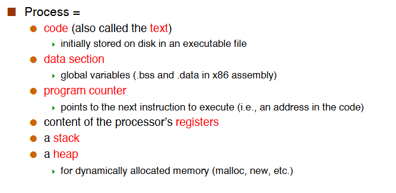

**Memory Layout of a C Program**

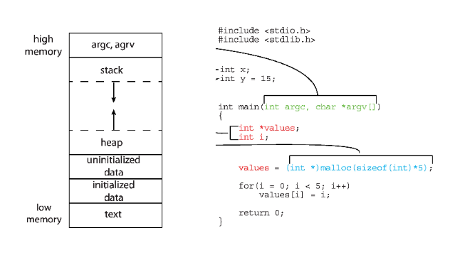

- `int x`: unintialized data
- `int y = 15`: initialized data
- 临时变量在栈上， malloc 在 heap 上。

### The Stack

每个函数运行时都会分配栈的一部分，即一个栈帧(stack frame / activation records).

- The stack is how we manage to have programs place successive function/method calls.
- Stack Frame
    - Any functions needs to have some state so that it can run. (Parameters, local variables, return address, return values)
    - Before calling a function, the caller needs to also save the state of its registers.
    - All the above goes on the stack as part of activation records, which grows downward.

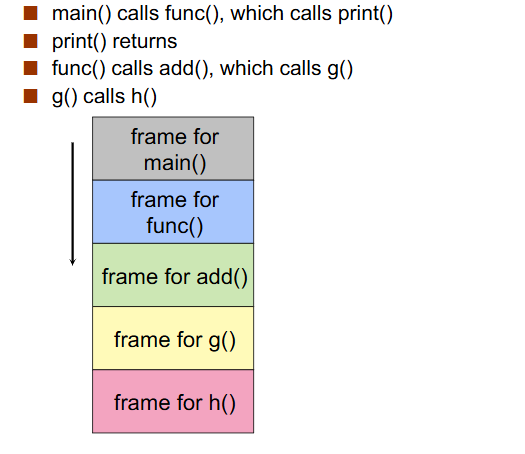

- Runtime Stack Growth
    - The stack can get too large
        - Hits some system-specified limit
        - Hits the heap
    - Runtime stack overflow
        - causes a trap, that will trigger the kernel to terminate your process with that error.
        - Typically due to infinite recursion.
- 2 processes for the same program
    - 运行同一个程序两次，内存布局不一定相同。
    - 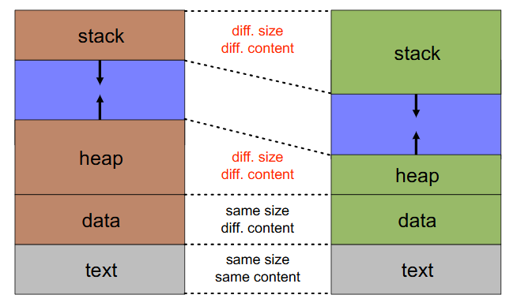

## Process Control Block(PCB)

每个进程有且仅有一个 PCB.

- information associated with each process (also called **task control block**)
- **Each process has and only has a PCB**
    - Allocate a PCB on new process creation
    - Free the PCB on process termination

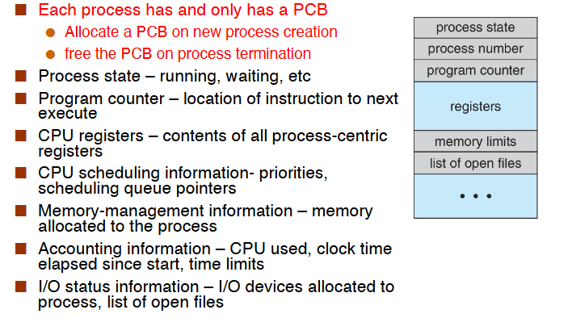

- Process Representation in Linux
    - Represented by the C structure `task_struct`.
    - 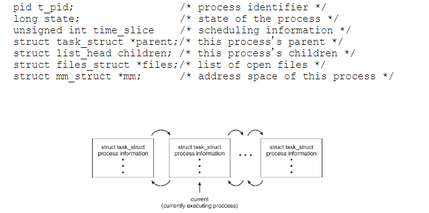
    - 用链表串起来的。

## Process State

As a process executes, it changes state

- New: The process is being created
- Running: Instructions are being executed
- Waiting: The process is waiting for some events to occur
- Ready: The process is waiting to be assigned to a processor
- Terminated: The process has finished exectuion

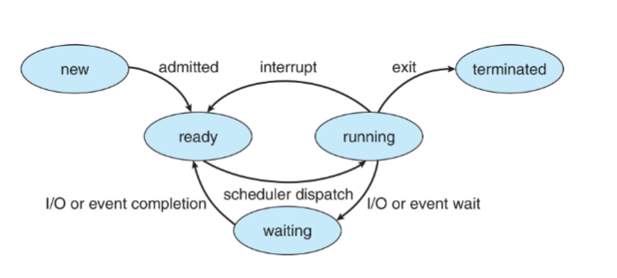

### Process Creation

- A process may create new processes
- We obation a tree of processes
- Each process has a pid
    - ppid refers to the parent's pid

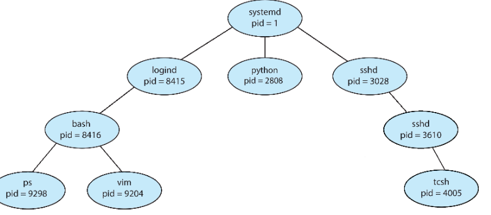

- The child may inherit/share some of the resources of its parent, or may have entirely new ones.
- A parent can also pass input to a child
- Upon creation of a child, the parent can either
    - continue execution
    - or wait for the child's completion
- The child could be either
    - a clone of the parent(i.e., have a copy of the address space) (一模一样)
    - or be an entirely new program

- `fork` system call
    - `fork()` creates a new process
    - The child is a copy of the parent(完整的一模一样的拷贝)
        - it has a different pid
        - its resource utilization(so far) is set to 0
    - `fork()` returns the child's pid to the parent, and 0 to the child.(`getpid()` call)
    - Both processes continue execution after the call to fork().

!!! Example

    ```C
        pid=fork();
        if(pid<0) {
            fprintf(stdout, "Error: can’t fork()\n");
            perror(“fork()”);
        }
        if(pid!=0) {
            fprintf(stdout, "I am parent and my child has pid%d\n",pid);
            while(1);
        } else {
            fprintf(stdout, "I am child, and my pid is %d\n", getpid());
            while(1);
        }
    ```

!!! Example 

    What does the following code print?

    ```c
    int a = 12;
    if (pid = fork()) { // PARENT
        // ask the OS to put me in waiting
        sleep(10);
        fprintf(stdout,”a = %d\n”,a);
        while (1);
    } else { // CHILD
        a += 3;
        while (1);
    }
    ```
    12!
    `fork` 之后变量的值相同，但并不是同一个变量。(相当于一份拷贝)

    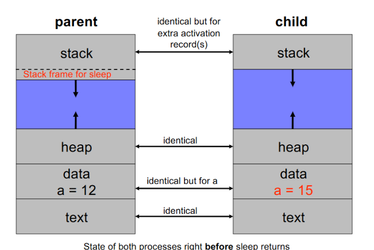

!!! Example

    How many processes does this C program create?

    ```C
    int main (int argc, char *arg[])
    {
        fork ();
        if (fork ()) {
            fork ();
        }
        fork (); 
    }
    ```
    12

- The `execve()` system call
    - `execve()` system call used after a `fork()` to replace the process' memory space with a new program.
    - 把之前的进程资源全部丢掉，加载新的 binary, 映射新的内存，分配新的堆栈。

### Process Terminations

当进程调用 `exit()` 这个系统调用时，这个进程将被终止，这意味着这个进程将不再执行，其资源将被释放，同时返回状态值，而这个状态值将被 parent 进程的 `wait()` 接收。

- A process terminates itself with the `exit()` system call.
    - This call takes as argument an integer that is called the process' exit/return/error code
- All resources of a process are deallocated by the OS
- A process can cause the termination of another process
    - Using something called “signals” and the kill() system call
- A parent can wait for a child to complete
    - The `wait()` call
        - blocks until any child completes
        - returns the pid of the completed child and the child's exit code.
    - The `waitpid()` call
        - blocks until a specific child compelets
        - can be made non-blocking with WHOHANG options
- A process can receive **signals** (i.e., software interrupts). Each signal causes a default behavior in the process.(当我们想要终止一个程序时，键入 `ctrl+c` 相当于对当前进程发送了 `SIGINT` 信号，就会终止当前进程。)
    - it is an asynchronous event that the program must act upon, in some way.
    - Manipulating Signals
        - Each signal causes a default behavior in the process (e.g., a SIGINT signal causes the procecss to terminate)
        - But most signals can be either ignored or provided with a user-written handler to perform soome actions. (SIGKLL nad SIGSTOP cannot for security reasons.)
        - `signal(SIGINT, SIG_IGN);//ignore signal`
        - `signal(SIGINT, SIG_DFL);//set behavior to default`
        - `signal(SIGINT, my_handler); // customize behavior`


!!! Example

    ```C
    #include<signal.h>
    #include <stdio.h>

    void handler(int sig) {
        fprintf(stdout, "I don't want to die!\n");
        return;
    }

    main() {
        signal(SIGINT, handler);
        while(1);
    }

    ```


- **Zombie**
    - When a child process terminates
        - Remains as a zombie in an undead state
        - Until it is reaped by the OS.
        - 不占用 CPU 但是还占用内存。
    - parent 尚未调用 `wait()`, 则这个 child 进程不会完全消失。
    - Get rid of zombies: when a child exits, a `SIGCHLD` signal is sent to the parent.(我们可以通过给 SIGCHILD 信号加一个 handler，里面调用 `wait` 来回收进程。)
- **Orphans**
    - 子进程还在运行时，它的父进程终止了，那么它就成为了一个孤儿进程。
    - UNIX 的解决办法：所有孤儿进程都成为 `init/systemd` 的 child 进程，由它来 `wait()` 孤儿进程。(pid 1 进程)
    - 有一个 trick: 可以创建一个与当前进程的父进程无关的进程：先 `fork()` 一个进程，随后杀死自己，那么当前进程的子进程就会被 pid 1 收养，就脱离了原来的父进程。

## Process Scheduling

- Maximize CPU use, quickly switch processes onto CPU core.
- Process scheduler selects among ready processes for next execution on CPU core.
- Maintains **scheduling queues** of processes
    - Ready queue: set of all processes residing in main memory, ready and waiting to execute. (只有一个 ready queue, ready queue 不会空，因为 IDLE 进程一直在里面)
    - Wait queue: set of processes waiting for an event(i.e., I/O) (有很多个 wait queue, 一个等待的事件对应一个 wait queu. 当这个事件到来的时候，从事件对应的 queue 里选择一个进程)
    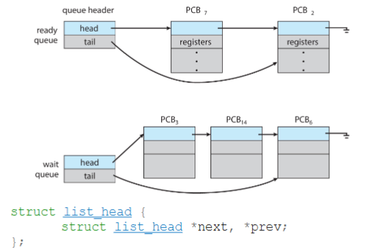
    - 当我们想要插入一个新的进程时，直接通过双向链表接上即可。
    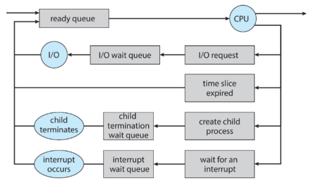

### Context switch

A context switch occurs when the CPU switches from one process to another.

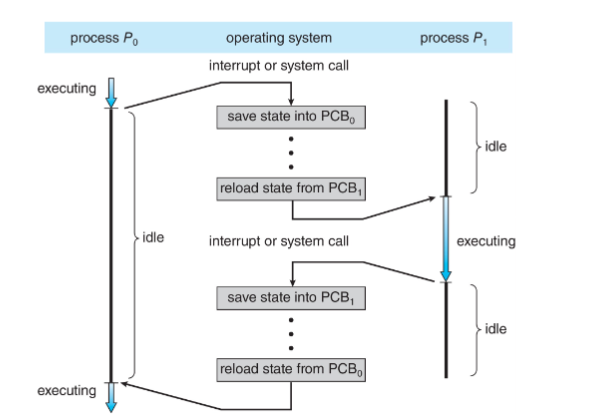

上下文切换时，系统存储当前进程的状态，并加载目标进程的状态。state 主要是寄存器的值，页表等等。

note: Context-switch time is overhead: the system does not do useful work while swtiching.
