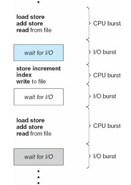
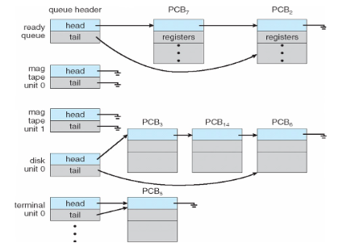
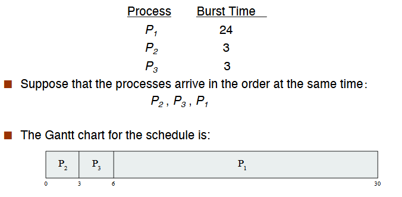
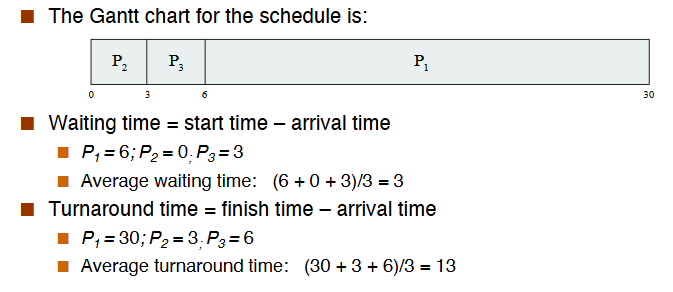
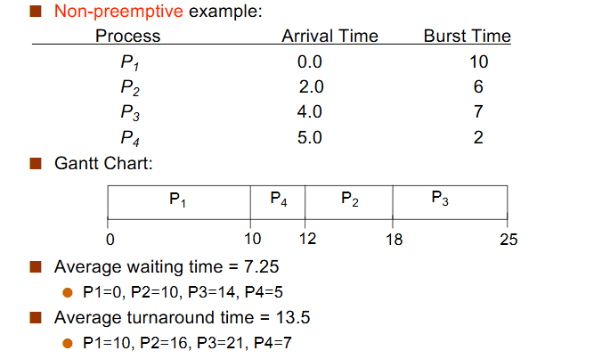
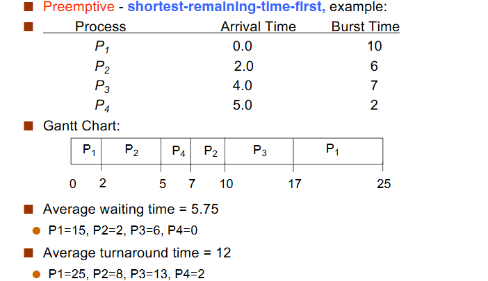
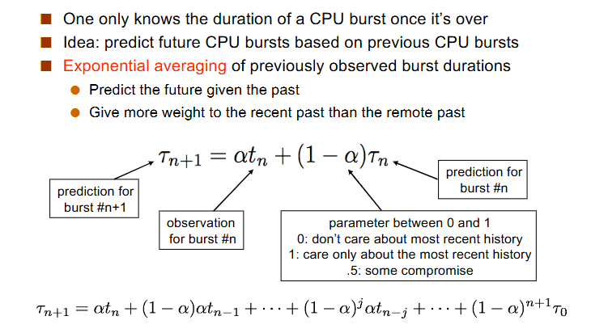
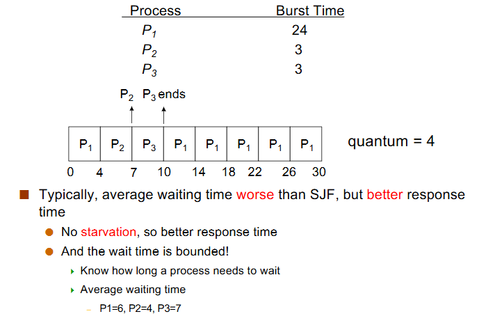
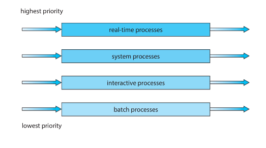

# Scheduling

## CPU Scheduling

- Definition: the decisions made by the OS to figure out which ready processes/threads should run and for how long.

### CPU-I/O Burst Cycle

- I/O-bound process: mostly waiting for I/O
- CPU-bound process: mostly waiting for CPU

### The CPU Scheduler

当 CPU 空闲时，从所有的 ready processes 中选一个继续跑。

- Non-preemptive scheduling: a process holds the CPU until it is willing to give it up.
- Preemptive sheduling: a process can be preempted even though it could have happily continued executing. 可以强制终止正在跑的进程。

### Scheduling Objectives

- maximize CPU Utilization: CPU 使用时间/总时间
- maximize throughput: 单位时间完成的进程数，看任务完成是否高效
- turnaround time: 从进程开始建立到进程完成的时间。
- waiting time: 进程在 ready queue 中等待的时间总和：等待时间=周转时间-运行时间
- response time: 从发出请求到第一次响应的时间

## Scheduling Mechanisms

### Scheduling Queues

- The kernel maintains queues in which processes are placed.
- the ready queue contains processes that are in the READY state
- Device Queues contain processes waiting for particular devices.

### Dispatcher

Dispatcher module gives control of the CPU to the process selected by the scheduler.

- switching to kernel mode
- switching context
- switching to user mode
- jumping to the proper lication in the user programe to restart that program

Dispatch latency: time it takes for the dispatcher to stop one process and start another to run.

## Scheduling Algorithms

### First-Come, First-Served (FCFS)

### Shortest-Job-First(SJF) Scheduling

选择需要运行时间最短的进程先运行。算法能保证平均等待时间最小，但是如果有一个进程运行时间很长，它可能一直被推迟，可能会出现 starvation. 并且实际情况中我们可能不知道进程运行时间多长。

分为抢占式和非抢占式：

- Predicting CPU burst durations
    - predict future CPU bursts based on previous CPU bursts

### Round-Robin Scheduling

- RR Scheduling is preemptive and designed for time-sharing

每个进程最多连续执行一个时间片的长度，完成后被插入 FIFO ready queue 的末尾，并去除 FIFO ready queue 的队首进行执行。

时间片越短，响应时间越短，但更短的时间片带来更频繁的进程切换，从而带来更多的 dispatch latency.

### Priority Scheduling

每个进程都有一个优先级，当多个进程处于 ready 的时候，选择优先级最高的进程运行。缺点是如果一个进程的优先级很低，它可能 starvation.

- simply implement the ready queue as a priority queue
- low-priority process starvation: priority aging
    - incease the priority of a process as it ages.

### Multilevel Queue Scheduling

我们可以考虑在特定情况下使用特定的调度算法：我们将 ready queue 分成多个队列，每个队列使用不同的调度算法，然后再进行队列间调度。

- Scheduling within queues:
    - each queue has its own scheduling policy
    - high-priority could be RR, low-priority could be FCFS
- Scheduling between the queues:
    - typically preemptive priority scheduling
    - a process can run only if all higher-priority queues are empty.

Rationale: non-CPU-intensive jobs should really get the CPU quickly on the rare occasions they need them, because they could be interactive processes (this is all guesswork, of course).

非 CPU-intensive 的进程应该尽快得到 CPU，因为它们可能是交互式进程。

- Multilevel Feedback Queue Scheduling
    - 允许进程在队列间转移，以实现更科学灵活的调度。例如，一个进程如果使用了过长的 CPU 时间，它可能被移动到优先级更低的队列；相反，如果一个进程等待了太久，它可能被移动到优先级更高的队列