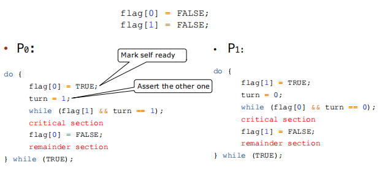
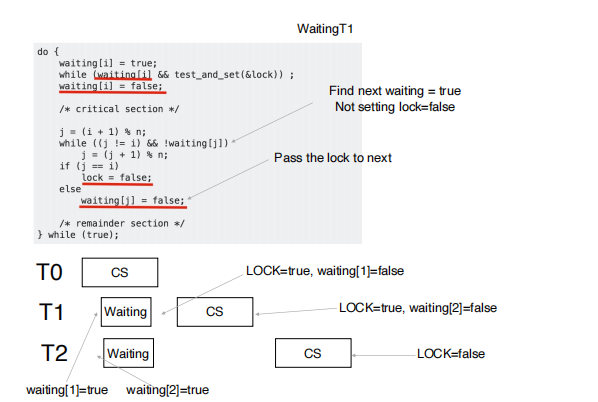

# Synchoronization

- Processes/threads can execute concurently
- Concurrent access to shared data may result in data inconsistency.

## Race condition

- Several processes (or threads) access and manipulate the same data **concureently** and the outcome of the execution depends on the **particular order** in which the access takes place, is called a race-condition.
    - 在 kernel 里可能有多个 thread 同时去拿一个 thread_id （两个进程同时 fork, 子进程可能拿到一样的 pid）
- General structure of process


- critical section: (a critical section segment of code, e.g. to change common variables, update table, write files etc.)
    - only one process in critical section, 
        - when one process in critical section, no other may be in its critical section.
        - each process must ask permission to enter critica section in entry section
        - the permission should be released in exit section
- critical section handling
    - single-core system: preventing interupts
    - multiple-processor: preventing interrupts are not feasible.Two approaches depending on if kernel is preemptive or non-preemptive.
        - preemptive: allows preemption of process when running in kernel mode.
        - non-preemptive: runs until exits kernel mode, blocks, or voluntraily yields CPU
    - **three requirements**
        - mutual exclusion (互斥访问): only one process can be execute in the critical section.
        - progress: 当没有线程在执行 critical section code 时，必须在申请进入临界区的线程中选择一个线程允许其执行临界区代码，保证程序执行的进展。
        - bounded waiting: 当一个进程申请进入临界区后，必须在有限的时间内获得许可并进入临界区，不能无限等待。

## Peterson's Solution



Peterson's solution solves two-processes/threads synchronizatioin (only works for two processes case).

- it assumes that LOAD and STORE are atomic(execution cannot be interrupted)
- Two processes share two variables
    - `boolean flag[2]`: whether a process is ready to enter the critical section.
    - `int turn`: whose turn it is to enter the critical secion.

可以验证符合 3 个 requirements.

Peterson's Solution 的问题：

- only works for two processes case
- it assumes that LOAD and STORE are atomic
- instruction order(指令可能会乱序，编译器调整 etc.)

## Hardware Support for Synchronization

Many systems provide hardware support for critical section code.


### Memory Barriers

Memory model are the memory guarantees a computer architecture makes to application programs.

- Strongly ordered: where a memory modification of one processsor is immediately visible to all other processors. (一个内存的修改会立刻被所有的 processor 看到)
- Weakly ordered: where a memory modification of one processor may not be immediately visible to all other processors.

A memory barrier is an instruction that forces any change in memory to be propagated (made visible) to all other processors.

### Hardware Instructions

#### Test-and-Set Instruction

Defined as below, but atomically. 保证原子性。原子性的操作天然保证了 mutual exclusion.

```c
bool test_set(bool *target) {
    bool rv = *target;
    *target = TRUE;
    return rv;
}
```

example: 

```c
bool lock = FALSE;
do {
    while(test_set(&lock)); //busy wait
    critical section
    lock = FALSE；
    remainder section
}while(TRUE);
```

我们考虑是否满足 3 个 requirments: 

- mutual exclusion: 原子性保证，同时执行的一系列 `test_and_set()` 只有一个能返回 `false`.
- progress: 只要没有进程处于 critical section, 那么 `lock` 肯定为 `false`.那么一定有就绪的进程能够进入 CS。并且能够在有限时间内变为 `false`.
- bounded waiting: 如果参与竞争的进程很多，可能出现某个进程 starvation.

不满足 bounded waiting 的根本原因就是 `lock=false` 的分配是随机的。因此我们通过某种确定的机制进行分配就能解决这个问题。



#### Compare-and-Swap Instruction

```c
int compare_and_swap(int *value, int expected, int new_value)
{
    int temp = *value;
    if (*value == expected)
        *value = new_value;
    return temp;
}
```

其实 `test_and_set(target)` 就是 `compare_and_swap(value, false, true)`.

Solution using Compare-and-Swap:

```c
while (true)
{
    while (compare_and_swap(&lock, 0, 1) != 0); /* do nothing */
    /* critical section */
    lock = 0;
    /* remainder section */
}
```

可以看到 `compare_and_swap()` 相比于 `test_and_set()` 有更大的操作空间。

### Atomic Variables

- Typically, instructions such as compare-and-swap are used as building blocks for other synchronzation tools.
- 原子变量是一种使用原子性操作维护的变量。
- 自增操作：

```c
increment(atomic_int * v) {
    int temp;
    do {
        tmp = *v;
    } while ( temp != compare_and_swap(v, temp, temp+1) );
}

```

可能有人把 temp 改掉了，因此要比较 v 和 temp 的值。

## Mutex Locks(互斥锁)

- Previous solutions are complicated and generally inaccessible to application programmers.
- OS designers build software tools to solve critical section problem.
- **Protect a critical section by first `acquire()` a lock then `release()` the lock. (must be atomic!)**

```c
while(true) {
    acuqire lock
    critical section
    release lock
    remainder section
}
```

```c
bool locked = false;
acuiqre() {
    while(compared_and_swap(&locked, false, true));//busy waiting
}

release() {
    locked = false;
}
```

但是存在问题：对于等待中的 process, 它们要不断进行 while 循环，在 Loop 中浪费 CPU 时间 (busy waiting)，占用 CPU 资源。因而这种使用 busy waitiing 的互斥锁也被称为 spinlock(自旋锁)。

因此我们思考能否避免无意义的等待，在等待的时候把资源让给有需要的进程。我们可以通过暂时切换进程，让这些处于等待的用户暂时休眠，等时机到来再唤醒它们。

yield -> moving from running to sleeping

## Semaphores

**synchronization tool that provides more sophisticated ways for process to synchronize their activities.**

- Semaphore: contain $$S$$ -- integer variable
- can only be accessed via two indivisble operations
    - `wait()` and `signal()`

```c
wait(S) {
    while(S <= 0); //busy wait 暗含保证 S >= 0
    S--;
}

signal(S) {
    S++;
}
```

我们可以用如下方式保证 S1 在 S2 之前执行：

```c
sem = 0;
P1:
    S1;
    signal(sem);
P2:
    wait(sem);
    S2;
```

### Semaphore waiting queue

- With each semaphore there is an associated waiting queue.
- Each entry in a waiting queue has two data items:
    - value
    - pointer to nex record in the list

```c
typedef struct{
    int value;
    struct list_head * waiting_queue;
} semaphore;
```

- Two operations:
    - block: place the process invoking the operation on the appropriate waiting queue.
    - wakeup: remove one of processes in the waiting queue and place it in the ready queue.

```c
struct semaphore {
    value;
    waiting_list;
};

<atomic> wait(reference S) {
    S->value--;
    if (S->value < 0) {
        S->waiting_list.push(current process);
        sleep();
    }
}

<atomic> signal(reference S) {
    S->value++;
    if (S->value <= 0) {
        p = S->waiting_list.pop();
        wakeup(p);
    }
}

```
## Deadlock and starvation

- Deadlock: two or more processes are waiting indefinitely for an event that can be caused by only one of the waiting processes.
- starvation: indefinite blocking. a process may never be removed from the semaphore's waiting queue.

## Priotity Inversion

- a higher priority process is indirectly preempted by a lower priority task.

即具有中等优先级的某个进程运行时间影响了具有较高优先级进程的等待时间。我们可以通过 priority inheritance 来解决这个问题：如果低优先级的进程拿到了锁，并且这个锁有高优先级的进程在等，就提高低优先级进程的优先级。

## Examples

### The Bounded-Buffer problem

又称 Producer-Consumer Problem. 该问题中有两个角色：

- producer: 产生 item 存放到 buffer 中
- consumer: 从 buffer 中取出 item.

现在我们考虑在并行条件下，`produce()` 和 `consume()` 同时发生，容易出现 race condition 的问题。

这里我们使用信号量来解决这个问题：

```c
// suppose the capacity of the buffer is n
semaphore mutex = 1;
semaphore empty = n;
semaphore full  = 0;
```

- The producer process


### The Readers-Writers Problem

用户使用数据库修改数据，会出现 read write 以及 write write 冲突。

Solution:

- semaphore mutex initialized to 1
- semaphore write initialized to 1
- semaphore readcount initialized to 1

- The writer process

```c
do {
    wait(write);
    //write the shared data
    ......
    signal(write);
}while(True);
```

- The reader process

```c
do {
    wait(mutex)
    readcount++;
    if(readcount == 1)
        wait(write);
    signal(mutex);

    //reading data
    ...

    wait(mutex);
    readcount--;
    if(readcount == 0)
        signal(write);
    signal(mutex);
}while(True);

```

`mutex` 用来保护 `readcount`, 如果 readcount=1, 就获得 `write` 的锁来保护这个 read。假设 writer 拿到了锁，这时候来了 5 个 reader, 那么第一个会 sleep 在 write 上，剩下 4 个 reader 会 sleep 在 mutex 上。假设此时 writer 完事了，那么此时第一个离开了 wait(write), signal(mutex),这时候所有的 reader 就可以同时开始读了。

### The Dining Philosophers Problem

Philosophers spend their lives thinking and eating, they sit in a round table, but don’t interact with each other.

They occasionally try to pick up 2 chopsticks(one at a time) to eat. 
