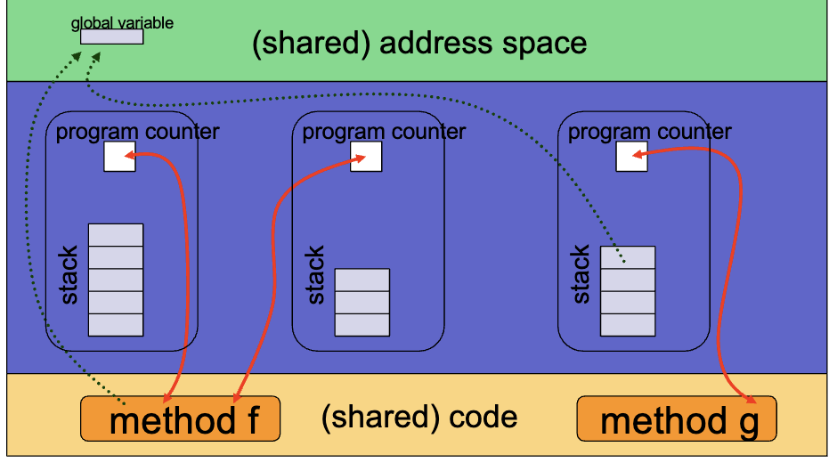
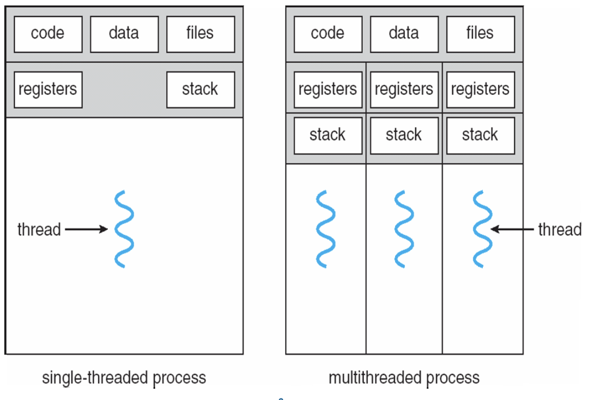
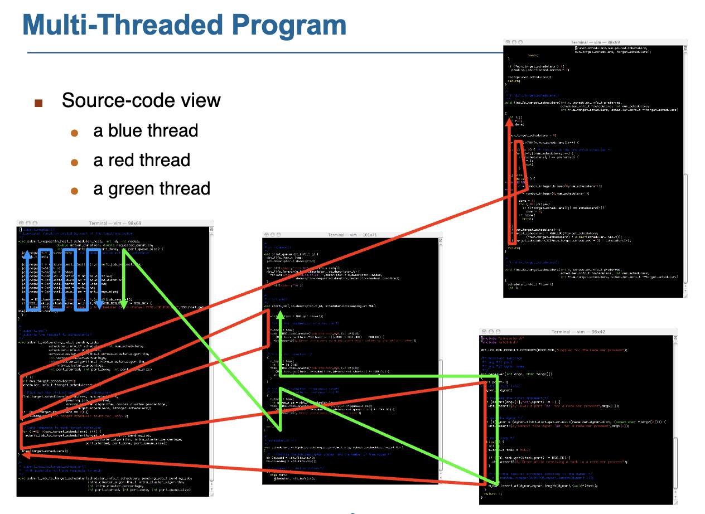
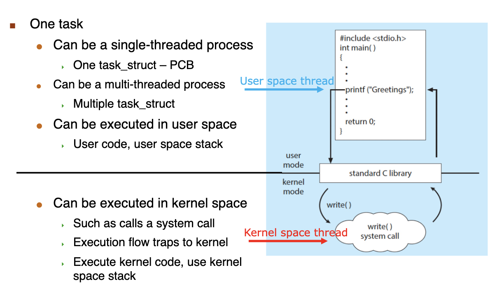

# Threads

!!! note "Why thread?"

    How can we make a process run faster?

    Multiple execution units with a process!

## Thread Definition

- A thread is a basic unit of execution within a process. (线程是执行单元。)
    - Each thread has its own:
        - thread ID
        - program counter
        - register set
        - Stack
    - It shares the following with other threads within the same process:
        - code section
        - data section
        - the heap(dynamically allocated memory)
        - open files and signals.
    - **Concurrency**: a multi-threaded process can do multiple things at once.

- Advantages of Threads
    - economy:
        - creating a thread is cheap(much cheaper than creating a process since code, data and heap are already in memory)
        - context-switching between threads is cheap
            - 换进程 switch_mm + cpu_switch_to 换进程不需要换 memory
            - no cache flush
    - Resource sharing:
        - threads naturally share memory
            - with processes you hae to use possibly complicated IPC
        - Having concurrent activities in the same address space is very powerful.
    - Responsiveness
        - A program that has concurrent activities is more responsive.
    - Scalability
- Drawbacks of Threads
    - weak isolation between threads: if one thread fails, then he process fails.
    - may be more memory-constrained than processes.
    - do not benefit from memory protection.
- Typical challenges of multi-threaded programming
    - Deal with data dependency and synchronization
    - Dividing activities among threads
    - Balancing load among threads
    - Split data among threads
    - Testing and debugging

## User Threads vs. Kernel Threads

- Many-to-One Model
    - advantage: multi-threading is efficient and low-overhead (no syscalls to the kernel)
    - 如果一个线程卡着，其它就都卡着了(一个 thread syscall 了，其它 thread 就不能 syscall.)
    - cannot take advantage of a multi-core architecture.
- One-to-One Model
    - overhead. 开销大
    - Linux and Windows 用这个
- Many-to-Many Model
- Two level Model

## Threading Issues

### Semantics of `fork()` and `exec()`

如果一个 thread 调用了 `fork()` ，那么我们要复制调用的线程还是复制所有的线程呢？

- Some OSes provide both options
- In Linux the first option above is used
    - If one calls `exec()` after `fork()`, **all** threads are wiped out anyway.

### Signals

- Multiple options:
    - deleiver the signal to the thread to which the signal applies
    - deliver the signal to every thread in the process
    - deliver the signal to certain threads in the process
    - assign a specific thread to receive all signals
- Most UNIX versions: a thread can say which signals it accepts and which signals it doesn't accept.
- On Linux: dealing with threads and signals is tricky but well understood with many tutorials on the matter and man pages.

### Safe Thread Cancellation

把一个线程的工作取消掉，但是不影响我们的系统(有可能取消的时候它在处理 shared data 之类的)

- Asynchronous cancellation
- Deferred cancellation (thread 觉得自己能够安全地被关掉时，就把自己取消掉。)

Default type is deferred. (Cancellation only occurs when thread reaches cancellation point)

## Linux Threads

- In Linux, a thread is also called a light-weight process(LWP)
- The `clone()` syscall is used to create a thread or a process
- TCB 用来存储线程的信息， Linux 并不区分 PCB 和 TCB，都是用 `task_strcut` 来表示。
- 如果 PID 和 LWP 相同，说明这个进程只有一个线程，否则说明线程有多个进程，此时进程的 PID 是主进程的 LWP.
- A process is
    - either a signal thread + an address space
    - or multiple threads + an address space.
- `mm_struct` (与内存管理相关的信息如页表，heap)是共享的，`task_struct, pid, stack` 是不共享的。(stack 4K 对齐)
- 用 `thread_group` 链表把 thread 串起来。

- One task in Linux
    - Same task_struct(PCB) means same thread
        - Also viewed as 1:1 mapping
        - One user thread maps to one kernel thread
        - But actually, they are the same thread.(kenerl space 线程可以理解为 user space 的小号)
    - Can be executed in user space(user code, user space stack)
    - Can be executed in kernel space(kenerl code 和 user code 不一样，其实就是执行 syscall, kernel space stack, kernel space 的栈固定 16K,user space 的栈大小不固定)
- 调完 syscall 之后要求 kernel stack 是空。

