# Virtual Memory

## Introduction

代码需要在内存里执行，但是整个程序几乎不会同时被使用。比如我们的代码在 3 页里，最开始执行时只有第一页在内存里，后面的页需要在需要的时候才会被加载到内存里。即我们可以把还没用到的 code 和 data 延迟加载到内存里，用到时再加载。

Consider ability to execute partially-loaded program:

- program no longer constrained by limits of physical memory.
- programs could be larger than physical memory

需要注意的是虚拟地址只是范围，并不能真正的存储数据，数据只能存在物理空间里。

## Demand Paging

按需换页，只把被需要的页载入内存。（当我们需要读写这个页的时候，说明我们需要这个页，这个时候再把这个页调入内存。）

- if page is invalid (error) -> abort the operation.
- if page is valid but not in memory -> bring it to memory.
    - memory heres means physical memory!
    - this is called **page fault**

### What causes page fault?

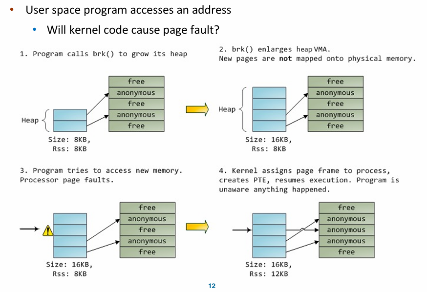

以 C 语言中的 malloc 为例，malloc 会调用 `brk()`. 增长堆的大小。
VMA 是 Virtual Memory Area，`brk()` 只是增大了 VMA 的大小（修改 vm_end），但是并没有真正的分配内存，只有当我们真正访问这个地址的时候，会触发 page fault，然后找一个空闲帧真正分配内存，并做了映射。

user space 的访存，MMU 引起的 page fault.

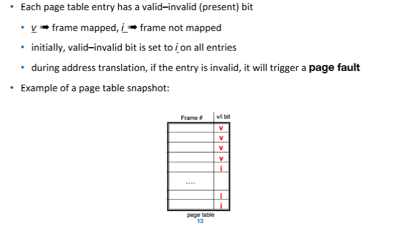

### Who handles page fault?

有两种情况：

- 地址本身超过了 `vma` 的范围，或者落在 heap 里但权限不对，这种情况操作系统会杀死进程。
- 落在 heap 里，权限正确，这个时候 os 就分配一个空闲帧，然后把这个页映射到这个帧上。

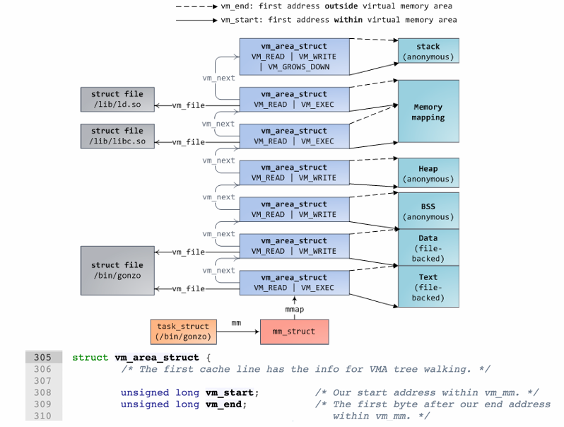

每个 fault 过来先查是否在 `vm_start`, `vm_end` 之间，以及查权限。如果落在 `vm_area_struct` 中间，那么就是 segmentation fault. 为了判断地址是否落在 vma 里，linux 使用红黑树来加速查找。 

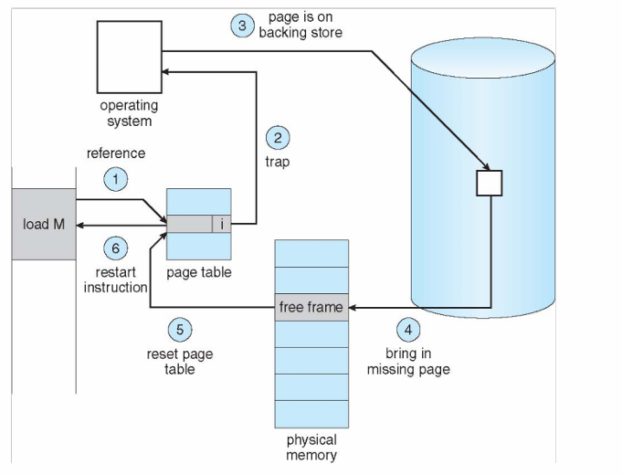

首先 MMU 找 page table 发现 invalid, 之后引发 trap, OS 在 physical memory 中找到一个空闲的帧，把需要的内容从磁盘搬过来，然后修改 Page table, 最后重新开始 instruction, MMU 重新开始找 page table.

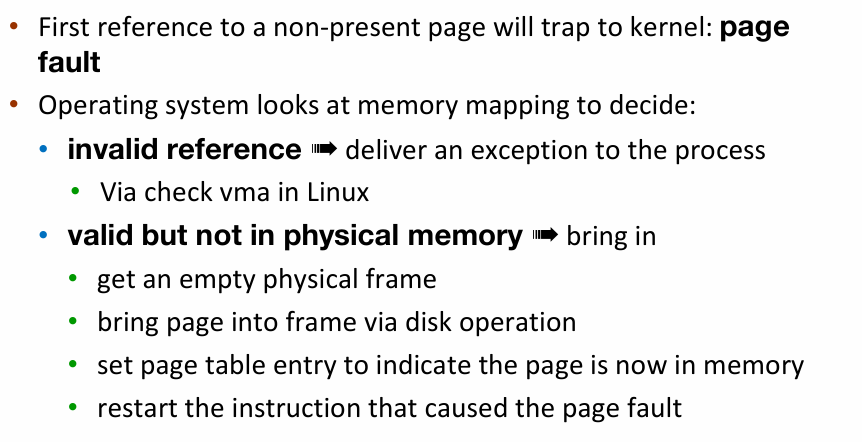

- swapper
    - lazy swapper: never swaps a page in memory unless it will be needed.
    - pre-paging: pre-page all or some of pages a process will need, before they are referenced.
        - it can reduce the number of page faults during execution.
        - if pre-pages are unused, I/O and memory was wasted.

在被需求之前页不会被载入内存，只有在内存被需求后才会被载入内存，我们称之为纯按需换页(pure demand paging)

- major page fault: 缺了的页不在内存中
- minor page fault: 缺了的页在内存中存在，只不过没在当前页表中建立映射。

- get free frame
    - most operating systems maintain a **free-frame list**: a pool of free frames for satisfying such requests.

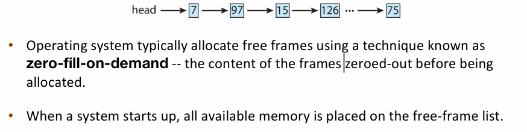

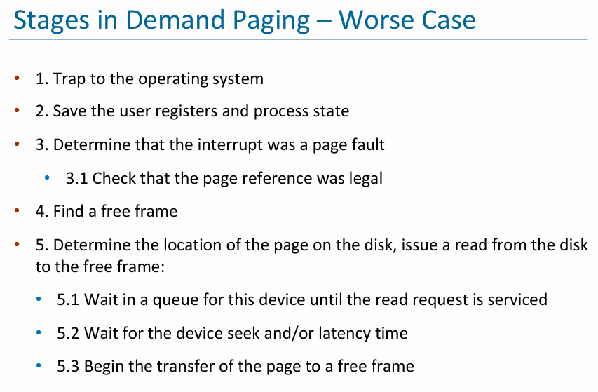

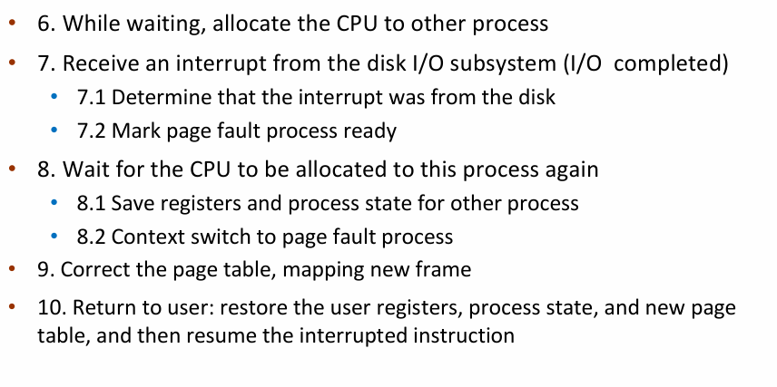

读硬盘的时候很慢，所以换进程，把 CPU 给别人，context_switch

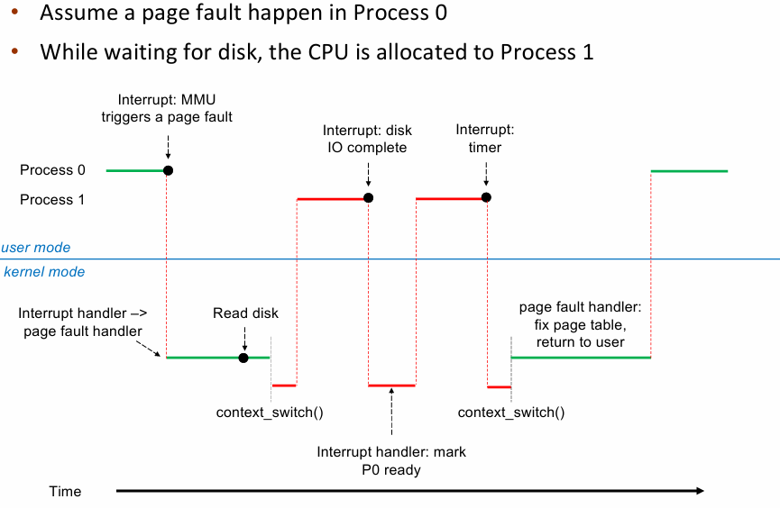

### Demanding Paging Optimizations

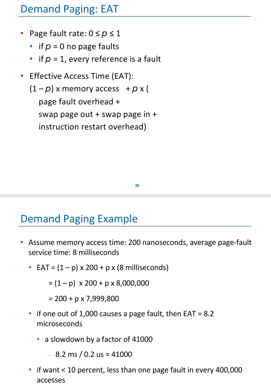

### Copy-on-Write

allows parent and child processes to initially share the same pages in memory.

提升 fork 效率，最开始页都是共享的，只有当父进程或子进程修改了页的内容时，才会真正为修改的页分配内存。

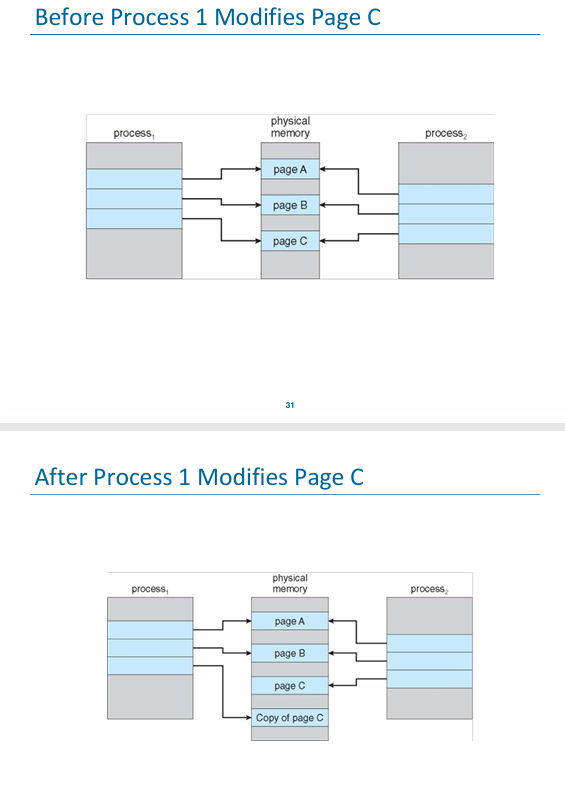

## Page Replacement

当 free-frame 不足时，我们需要进行替换。换谁？

**find some page in memory, but not really in use, page it out.**

### Page Replacement Mechanism

Page Fault Handler(with Page Replacement):

To page in a page:

- find the location of the desired page on disk
- find a free frame
    - if there is a free frame, use it.
    - if there is none, use a page replacemente polilcy to pick a victim frame, write victime frame to disk if dirty.
- bring the desired page into the free frame; update the page tables
- restart the instruction that caused the trap

### Page Replacmenet Algorithms

如何评价一个算法好坏：用一串 memory reference string，每个数字都是一个页号，给出物理页的数量，看有多少个 page faults.

- First-In-First-Out: replace the first page loaded.
    - 内存中维护一个 FIFO 队列来实现
    - 缺点：先被载人的 page 也可能会被频繁使用。
    - adding more frames can cause more page faults. (Belady's Anomaly)
- Optimal Algorithm: replace page that will not be used for the longest time. (在未来最久的时间内不会被访问到的页作为 victime)
    - 但是我们预测不了，所以只是理论最优。
- Least Recently Used(LRU): replaces pages that have not been used for the longest time.
    - counter-based
        - every page table entry has a counter(时间戳，每次访问这个页的时候更新时间戳。需要驱逐的时候找时间戳最小的页)
        - every time page is referenced, copy the clock into the counter
        - when a page needs to be replaced, search for page with smallest counter. 
    - stack-based
        - keep a stack of page numbers(in double linked list)
        - when a page is referenced, move it to the top of the stack
        - lease used frame 总是位于序列尾部，因此不需要额外的搜索。
    - LRU Approximation Implementation
        - 计数器做法，维护 clock 很慢，并且对于两者没醋访问内存的时候都需要维护，如果通过 interrupt 来调用 algorithm, 开销很大。
        - LRU approximation with a reference bit
            - when page is referenced, set the bit to 1(done by hardware)
            - replace any page with reference bit = 0 (if one exists)
            - we do not know the order however.
        - Additional-Reference-Bits Algroithm
            - 8-bits byte for each page
            - During a time interval (100ms), shifts bit rights by 1 bit, sets the high bit if used, and then discards the low-order bit
        - Second chance algoriithm(clock-replacement)
            - if page to be replaced has
                - reference bit = 0 -> replace it
                - reference bit = 1 then: set reference bit 0, leave page in memory, replace next page subjecting to the same rules.
- Counting-based Page Replacement
    - keep the number of references made to each page(counter 记录正在使用的frame 被使用的次数)
    - Least Frequently Used(LFU) replaces page with the smallest counter
    - Most Frequently Used (MFU) replaces page with the largest counter
    - not common.

## Page-Buffering Algorithms

Keep a pool of free frame: 维持一个空闲帧的 pool, 当需要的时候直接从 pool 里取一个。

## Allocation of Frames

Each process needs minimum number of frames - according to instructions semantics.

如何给不同的进程分配 frame:

- equal allocation
- proportional allocation: allocate according to the size of process.

- Global replacement – process selects a replacement frame from the set of all frames; one process can take a frame from another. 可以抢其它进程的帧。
    - Reclaiming Pages: page replacement is triggered when the list falls below a certain threshold. 如果 free list 里的帧数低于阈值，就触发 page replacement。这个策略希望保证这里有充足的自由内存来满足新的需求。

- Local replacement – each process selects from only its own set of allocated frames.

## Thrashing

倘若系统的多道程度过高，那么可能分配给每一个 process 的 frames 数量就会比较少，process 所使用的 frames 中被频繁使用的 page 占比更大。这时候可能就会产生较为频繁的 paging 活动——几乎所有 frames 都正在被使用，相当于每次置换都会导致一个新的 page fault——进而导致 CPU 的利用率下降，这种现象被称为抖动(thrashing)。

例如，process A 可能抢走了 process B 的正要被使用的 frame，于是导致 process B 之后会产生一次 page fault；而在处理这个 page fault 的时候，可能又把 process C 的正要使用的 frame 给抢走了.

Why does thrashing occur?: total memory size < total size of locality(一个 locality 大小比内存大，因此我们不得不一直换进换出页。)

使用 working set model 来解决 thrashing:

- working-set window($\Delta$): a fixed number of page references
    - 把所有 locality 称为一个工作集，windows 是一个关于时间的窗口，代表最近 $\Delta$ 次对页面的访问。
- Working set of process $p_i$ total number of pages referenced in the most recent $\Delta$ 
- Total working sets: $D=\sum \text{WSS}_i$
    - approximation of total locality
    - if $D>m$, possibility of thrashing(即所有进程的 working set 的大小之和大于可用 frame 的数量，那么就可能会出现 thrashing)
    - to avoid, if$D>m$, suspend or swap out some processes.
    - 确定一个进程频繁访问的页面，保证这些页面不被换出；需要调页时从剩余的页面进行交换。如果频繁访问的页面数已经大于了当前进程可用的页面数，操作系统就应当把整个进程换出，以防止出现抖动现象。
- Keeping track of the working set